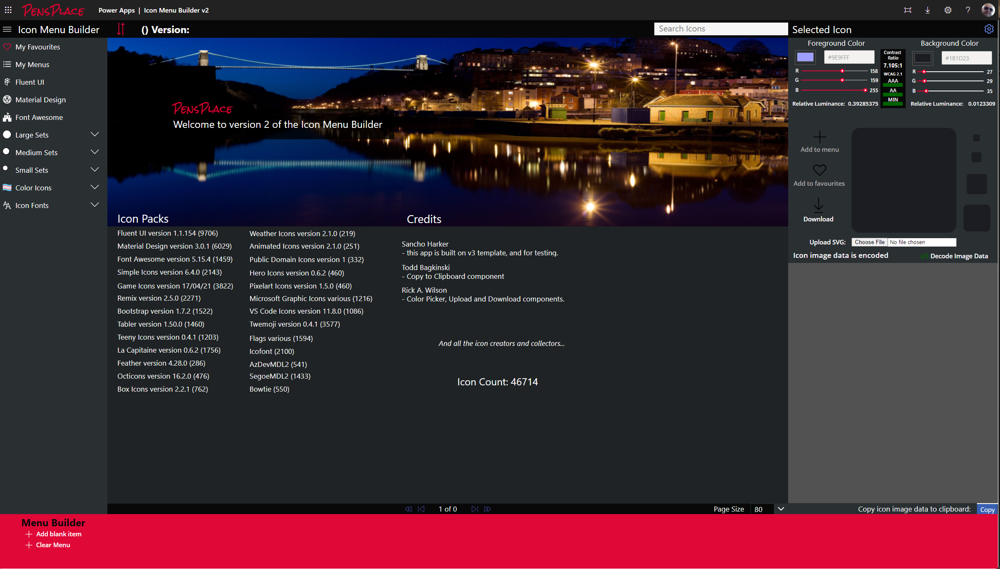

Happy to say V2 is now released, please view the updated installation guide [here.](./docs/getting-started/installation).

Features:
* Over 45K included Icons
* Save Favourite Icons
* Copy PowerFx SVG (URL Encoded and Decoded) and Menu Collection code
* Download Icons
* Upload Icons
* Create and Save Icon Menus
* WCAG 2.1 Color Contrast Checker

Hope you find it useful!