Technical Documentation
==================================

Contents
========

- [Technical Documentation](#technical-documentation)
- [Contents](#contents)
- [Icon Menu Builder v2](#icon-menu-builder-v2)
  - [StartScreen](#startscreen)
  - [OnStart](#onstart)
- [Connections](#connections)
- [Screens](#screens)
  - [Loading Screen](#loading-screen)
    - [Global variables](#global-variables)
    - ['Loading Screen' As screen](#loading-screen-as-screen)
      - [OnVisible](#onvisible)
  - [Home Screen](#home-screen)
    - [Global variables](#global-variables-1)
    - ['Home Screen' As screen](#home-screen-as-screen)
      - [OnVisible](#onvisible-1)
    - [gal_menu As gallery.galleryVertical](#gal_menu-as-gallerygalleryvertical)
      - [Items](#items)
      - [OnSelect](#onselect)
    - [gal_MenuBuilder As gallery.galleryHorizontal](#gal_menubuilder-as-gallerygalleryhorizontal)
      - [Items](#items-1)
    - [btn_hid_add_blank_item As button](#btn_hid_add_blank_item-as-button)
      - [OnSelect](#onselect-1)
      - [Text](#text)
    - [Button3_1 As button](#button3_1-as-button)
      - [OnSelect](#onselect-2)
      - [Text](#text-1)
    - [Button3_8 As button](#button3_8-as-button)
      - [OnSelect](#onselect-3)
      - [Text](#text-2)
    - [selected_Icon As image](#selected_icon-as-image)
      - [Image](#image)
    - [iconImageData As text](#iconimagedata-as-text)
    - [add_fav_1 As image](#add_fav_1-as-image)
      - [Image](#image-1)
      - [OnSelect](#onselect-4)
    - [add_fav As image](#add_fav-as-image)
      - [Image](#image-2)
      - [OnSelect](#onselect-5)
    - [selected_Icon_1 As image](#selected_icon_1-as-image)
      - [Image](#image-3)
    - [selected_Icon_2 As image](#selected_icon_2-as-image)
      - [Image](#image-4)
    - [selected_Icon_3 As image](#selected_icon_3-as-image)
      - [Image](#image-5)
    - [selected_Icon_4 As image](#selected_icon_4-as-image)
      - [Image](#image-6)
    - [Button3_2 As button](#button3_2-as-button)
      - [OnSelect](#onselect-6)
      - [Text](#text-3)
    - [Button3_3 As button](#button3_3-as-button)
      - [OnSelect](#onselect-7)
      - [Text](#text-4)
    - [Button3_4 As button](#button3_4-as-button)
      - [OnSelect](#onselect-8)
      - [Text](#text-5)
    - [Button3_5 As button](#button3_5-as-button)
      - [OnSelect](#onselect-9)
      - [Text](#text-6)
    - [Image1 As image](#image1-as-image)
      - [Image](#image-7)
      - [OnSelect](#onselect-10)
    - [img_next As image](#img_next-as-image)
      - [Image](#image-8)
      - [OnSelect](#onselect-11)
    - [img_prev As image](#img_prev-as-image)
      - [Image](#image-9)
      - [OnSelect](#onselect-12)
    - [img_prev_first As image](#img_prev_first-as-image)
      - [Image](#image-10)
      - [OnSelect](#onselect-13)
    - [img_next_last As image](#img_next_last-as-image)
      - [Image](#image-11)
      - [OnSelect](#onselect-14)
    - [gal_icons As gallery.galleryVertical](#gal_icons-as-gallerygalleryvertical)
      - [Items](#items-2)
      - [OnSelect](#onselect-15)
    - [gal_mymenus As gallery.galleryVertical](#gal_mymenus-as-gallerygalleryvertical)
      - [Items](#items-3)
      - [OnSelect](#onselect-16)
    - [gal_menuitems As gallery.galleryVertical](#gal_menuitems-as-gallerygalleryvertical)
      - [Items](#items-4)
    - [gal_myfavs As gallery.galleryVertical](#gal_myfavs-as-gallerygalleryvertical)
      - [Items](#items-5)
      - [OnSelect](#onselect-17)
    - [frm_menu_item As form](#frm_menu_item-as-form)
      - [DataSource](#datasource)
      - [Item](#item)
    - [Image10 As image](#image10-as-image)
      - [Image](#image-12)
    - [Image10_1 As image](#image10_1-as-image)
      - [Image](#image-13)
    - [Button2 As button](#button2-as-button)
      - [OnSelect](#onselect-18)
      - [Text](#text-7)
    - [DataCardValue1 As text](#datacardvalue1-as-text)
    - [DataCardValue4 As text](#datacardvalue4-as-text)
    - [DataCardValue5 As text](#datacardvalue5-as-text)
    - [DataCardValue6 As text](#datacardvalue6-as-text)
    - [DataCardValue7 As text](#datacardvalue7-as-text)
    - [DataCardValue9 As text](#datacardvalue9-as-text)
    - [DataCardValue10 As text](#datacardvalue10-as-text)
    - [DataCardValue11 As text](#datacardvalue11-as-text)
    - [Image12 As image](#image12-as-image)
      - [Image](#image-14)
      - [OnSelect](#onselect-19)
    - [Button3_7 As button](#button3_7-as-button)
      - [OnSelect](#onselect-20)
      - [Text](#text-8)
    - [inp_menu_title As text](#inp_menu_title-as-text)
    - [Gallery1 As gallery.galleryHorizontal](#gallery1-as-gallerygalleryhorizontal)
      - [Items](#items-6)
    - [Button1 As button](#button1-as-button)
      - [OnSelect](#onselect-21)
      - [Text](#text-9)
    - [Button1_1 As button](#button1_1-as-button)
      - [OnSelect](#onselect-22)
      - [Text](#text-10)
  - [Theme Palette](#theme-palette)
    - [Global variables](#global-variables-2)
    - ['Theme Palette' As screen](#theme-palette-as-screen)
      - [OnVisible](#onvisible-2)
    - [btn_RoundedBackgroundTile_TP As button](#btn_roundedbackgroundtile_tp-as-button)
      - [OnSelect](#onselect-23)
      - [Text](#text-11)
    - [Image2 As image](#image2-as-image)
      - [OnSelect](#onselect-24)
  - [Admin Settings](#admin-settings)
    - [Global variables](#global-variables-3)
    - ['Admin Settings' As screen](#admin-settings-as-screen)
    - [lbl_HiddenDevThings_BackPanel_AS As button](#lbl_hiddendevthings_backpanel_as-as-button)
      - [Text](#text-12)
    - [lbl_DeveloperMode_BackPanel_AS As button](#lbl_developermode_backpanel_as-as-button)
      - [Text](#text-13)
    - [lbl_YourSettings_BackPanel_AS As button](#lbl_yoursettings_backpanel_as-as-button)
      - [Text](#text-14)
  - [Administration Screen](#administration-screen)
    - [Global variables](#global-variables-4)
    - ['Administration Screen' As screen](#administration-screen-as-screen)
      - [OnVisible](#onvisible-3)
    - [gal_admin_menu As gallery.galleryVertical](#gal_admin_menu-as-gallerygalleryvertical)
      - [Items](#items-7)
      - [OnSelect](#onselect-25)
    - [Gallery2 As gallery.galleryVertical](#gallery2-as-gallerygalleryvertical)
      - [Items](#items-8)
- [Global Variables](#global-variables-5)
  - [StartLoadingScreenTimer](#startloadingscreentimer)
  - [DevHidden](#devhidden)
  - [newMyMenuID](#newmymenuid)
  - [galDefault](#galdefault)
  - [Color3TextJSON](#color3textjson)
  - [thisMenuID](#thismenuid)
  - [DownloadImage](#downloadimage)
  - [hideMenu](#hidemenu)
  - [showCollection](#showcollection)
  - [iconicLight](#iconiclight)
  - [ShowTheme](#showtheme)
  - [varUser](#varuser)
  - [ThisTheme](#thistheme)
  - [FileValue](#filevalue)
  - [varRecord](#varrecord)
  - [editMenu](#editmenu)
  - [ControlsTheme](#controlstheme)
  - [createNewMenu](#createnewmenu)
  - [LoadingText](#loadingtext)
  - [ChosenTheme](#chosentheme)
  - [onReset](#onreset)
  - [FontIncrement](#fontincrement)
  - [defaultIconColor](#defaulticoncolor)
  - [Color1JSON](#color1json)
  - [ChosenControlsTheme](#chosencontrolstheme)
  - [ChosenFontSizes](#chosenfontsizes)
  - [bootstrapLight](#bootstraplight)
  - [FontSizes](#fontsizes)
  - [removeFav](#removefav)
  - [menuDefault](#menudefault)
  - [AccessibilityThemeSet](#accessibilitythemeset)
  - [Developer](#developer)
  - [newItem](#newitem)
  - [editMenu](#editmenu-1)
  - [Color3JSON](#color3json)
  - [ControlsTheme](#controlstheme-1)
  - [Color2JSON](#color2json)
  - [TriggerFileSelector](#triggerfileselector)
  - [galDefault](#galdefault-1)
  - [FileName](#filename)
  - [Color2TextJSON](#color2textjson)
  - [Color1TextJSON](#color1textjson)
  - [galDefault](#galdefault-2)
  - [createNewMenu](#createnewmenu-1)
  - [ThisCurrentControlsThemeBackup](#thiscurrentcontrolsthemebackup)
  - [ThisCurrentThemeBackup](#thiscurrentthemebackup)
  - [editing](#editing)
  - [addedtofav](#addedtofav)
  - [ControlsFontSizes](#controlsfontsizes)
- [DataSources](#datasources)
  - [Collections](#collections)
    - [tempItems](#tempitems)
    - [col_icons](#col_icons)
    - [MyMenuItems](#mymenuitems)
    - [MyMenuItems](#mymenuitems-1)
    - [newMenu](#newmenu)
    - [col_MyMenus](#col_mymenus)
    - [DECtoHEX](#dectohex)
    - [tempMenu](#tempmenu)
    - [fontmenu](#fontmenu)
    - [fontmenu](#fontmenu-1)
    - [adminMenu](#adminmenu)
    - [newMenu](#newmenu-1)
    - [col_MyMenuItems](#col_mymenuitems)
    - [col_myFavouriteIcons](#col_myfavouriteicons)
    - [MyMenus](#mymenus)
    - [flags](#flags)
    - [col_MyMenuItems](#col_mymenuitems-1)
    - [gal_mymenus.Selected.Title](#gal_mymenusselectedtitle)
    - [demoMenu](#demomenu)
    - [col_temp](#col_temp)
    - [rowCounter](#rowcounter)
    - [col_icons](#col_icons-1)
    - [col_fontmenu_home](#col_fontmenu_home)
    - [col_myFavouriteIcons](#col_myfavouriteicons-1)
  
  

# Icon Menu Builder v2
  

## StartScreen


```typescript
'Loading Screen'
```  
  

## OnStart


```typescript
///////////////////////////////////////////////////////////////////////////////////////
//                                                                                   //
//  Place your own App.OnStart code after the FOOTER at the bottom of this code.     //
//  I DO NOT recommend loading any data during the App OnStart, this should be       //
//  done during the loading screen, so that the user is IN the App and visually      //
//  engaged so that their attention is kept.                                         //
//                                                                                   //
//  Additionally, with 'Non-blocking OnStart' moving out of preview in the future,   //
//  this will become a requirement for Apps to ensure that an async race-condition   //
//  is not created by having calls from the first screen reliant on calls from       //
//  the OnStart having completed. Please be aware and careful of this!               //
//                                                                                   //
//  The 'normal' Power Apps pre-loading screen will see your users looking at an     //
//  endlessly spinning item that is not engaging, I highly suggest drawing their     //
//  attention in the loading screen.                                                 //
//                                                                                   //
//  Do not move the setting of the initial variables away from the OnStart.          //
//  This ensures that your objects are branded before the App is loaded into view.   //
//                                                                                   //
///////////////////////////////////////////////////////////////////////////////////////
  ////  ////  ////  ////  ////  ////  ////  ////
///////////////////////////////////////////////////////////////////////////////////////
//    This section sets the default colours for all default items within the App.    //
//           This will mean all default items are branded 'automagically'.           //
///////////////////////////////////////////////////////////////////////////////////////


///////////////////////////////////////////////////////////////////////////////////////
//                                                                                   //
//          -- Set Colours & Values --                                               //
//                                                                                   //
//  To set your own permanent and default theme, change:                             //
//  - the 3 colours                                                                  //
//  - the 3 text colours that contrast those effectively                             //
//  - the default Text colour                                                       //
//  - the default font and its size (will affect other sizes)                        //
//  - whether the Theme is DarkMode                                                  //
//                                                                                   //
//  (DarkMode sets: Background colour for Screen, Checkboxes, Radio items.           //
//   These can of course be over-ridden by changing the property on the object.      //
//   I changed these to give more contrast than the standard backgrounds or items.   //
//   These are set to a colorfade -50% or +50% of a Color if Darkmode is True/False  //
//                                                                                   //
///////////////////////////////////////////////////////////////////////////////////////

Set(
    ThisTheme,
    {
        Name:                               "PensPlace Dark",

        Color1:                             RGBA(8,8, 8, 1),
        Color2:                             RGBA( 42,  47, 50, 1),
        Color3:                             RGBA(  224,  8, 55, 1),
        Color1Text:                         RGBA( 255,  255,  255, 1),
        Color2Text:                         RGBA(245, 245, 245, 1),
        Color3Text:                         RGBA(111,147,255,1),

        defaultTextColor:                   RGBA( 248,  248,  248, 1),
        
        Font:                               Font.'Segoe UI',
        FontSize:                           14,

        DarkMode:                           true
    } 
);

Set(ThisThemeBackup, ThisTheme);
////////////////////////////////////
//                                //
// -- Set Secondary Font Sizes -- //
//                                //
//    These are based on the      //
//   theme's default font size    //
//                                //
//   Feel free to add your own    //
//   and override the value in    //
//   the ControlsTheme section    //
//                                //
////////////////////////////////////

Set(
    FontSizes,
    {
        TextMain:                           ThisTheme.FontSize -1,
        TextEmphasis:                       ThisTheme.FontSize +1,
        Content:                            ThisTheme.FontSize +2,
        Title:                              ThisTheme.FontSize +6,
        SubTitle:                           ThisTheme.FontSize +4,
        AddPicture:                         ThisTheme.FontSize -3,
        FontBrower:                         ThisTheme.FontSize -5
    }
);

////////////////////////////////////////////////
//                                            //
// -- Set Control-level default Properties -- //
//                                            //
////////////////////////////////////////////////

Set(
    ControlsTheme,
    {

        LabelTextColor:                     ThisTheme.defaultTextColor,
        LabelFill:                          Transparent,
        LabelBorderColor:                   ThisTheme.Color2,
        LabelFont:                          ThisTheme.Font,

        ButtonColor:                        ThisTheme.Color2Text,
        ButtonFill:                         ThisTheme.Color2,
        ButtonBorderColor:                  ThisTheme.Color1,
        ButtonHoverColor:                   ColorFade(ThisTheme.Color2Text, 20%),
        ButtonHoverFill:                    ColorFade(ThisTheme.Color2,     20%),
        ButtonHoverBorderColor:             ColorFade(ThisTheme.Color1,     20%),
        ButtonPressedColor:                 ThisTheme.Color2,
        ButtonPressedFill:                  ThisTheme.Color2Text,
        ButtonPressedBorderColor:           ThisTheme.Color2,
        ButtonFont:                         ThisTheme.Font,

        InputTextColor:                     ThisTheme.Color1Text,
        InputFill:                          ThisTheme.Color1,
        InputBorderColor:                   ThisTheme.Color2,
        InputHoverColor:                    ColorFade(ThisTheme.Color1Text, 20%),
        InputHoverFill:                     ColorFade(ThisTheme.Color1, 20%),
        InputHoverBorderColor:              ColorFade(ThisTheme.Color2, 20%),
        InputPressedColor:                  ThisTheme.Color1Text,
        InputPressedFill:                   ThisTheme.Color1,
        InputPressedBorderColor:            ColorFade(ThisTheme.Color2, 20%),
        InputFont:                          ThisTheme.Font,
        InputDelayOutput:                   true,

        PenInputInkColor:                   ThisTheme.defaultTextColor,
        PenInputBorderColor:                ThisTheme.defaultTextColor,
        PenInputInkSize:                    2,
        PenInputBackground:                 Transparent,

        DropdownTextColor:                  ThisTheme.Color1Text,
        DropdownFill:                       ThisTheme.Color1,
        DropdownBorderColor:                ThisTheme.Color2,
        DropdownHoverColor:                 ColorFade(ThisTheme.Color1Text, 20%),
        DropdownHoverFill:                  ColorFade(ThisTheme.Color1, 20%),
        DropdownHoverBorderColor:           ColorFade(ThisTheme.Color2, 20%),
        DropdownPressedColor:               ThisTheme.Color1,
        DropdownPressedFill:                ThisTheme.Color1Text,
        DropdownPressedBorderColor:         ColorFade(ThisTheme.Color2, -20%),
        DropdownChevronBackground:          ThisTheme.Color2,
        DropdownChevronFill:                ThisTheme.Color2Text,
        DropdownChevronHoverBackground:     ColorFade(ThisTheme.Color2, 20%),
        DropdownChevronHoverFill:           ColorFade(ThisTheme.Color2Text, 20%),
        DropdownSelectionColor:             ThisTheme.Color3Text,
        DropdownSelectionFill:              ThisTheme.Color3,
        DropdownFont:                       ThisTheme.Font,

        ComboBoxTextColor:                  ThisTheme.Color1Text,
        ComboBoxFill:                       ThisTheme.Color1,
        ComboBoxBorderColor:                ThisTheme.Color2,
        ComboBoxHoverColor:                 ColorFade(ThisTheme.Color1Text, 20%),
        ComboBoxHoverFill:                  ColorFade(ThisTheme.Color1, 20%),
        ComboBoxHoverBorderColor:           ColorFade(ThisTheme.Color2, 20%),
        ComboBoxPressedColor:               ThisTheme.Color2Text,
        ComboBoxPressedFill:                ThisTheme.Color2,
        ComboBoxPressedBorderColor:         ColorFade(ThisTheme.Color2, -20%),
        ComboBoxSelectionColor:             ThisTheme.Color3Text,
        ComboBoxSelectionFill:              ThisTheme.Color3,
        ComboBoxChevronBackground:          ThisTheme.Color2,
        ComboBoxChevronFill:                ThisTheme.Color2Text,
        ComboBoxChevronHoverBackground:     ColorFade(ThisTheme.Color2, 20%),
        ComboBoxChevronHoverFill:           ColorFade(ThisTheme.Color2Text, 20%),
        ComboBoxFont:                       ThisTheme.Font,
        ComboBoxMoreItemsButtonColor:       ThisTheme.Color2,
        
        DatePickerColor:                    ThisTheme.Color1Text,
        DatePickerFill:                     ThisTheme.Color1,
        DatePickerBorderColor:              ThisTheme.Color2,
        DatePickerIconFill:                 ThisTheme.Color2Text,
        DatePickerIconBackground:           ThisTheme.Color2,
        DatePickerSelectedDateFill:         ThisTheme.Color2,
        DatePickerHoverDateFill:            ThisTheme.Color3Text,
        DatePickerHeaderFill:               ThisTheme.Color3,
        DatePickerFont:                     ThisTheme.Font,
        //
        // Sancho's note:
        // Tried to template these but IDE import only picks up design properties currently :(
        //
        // DatePickerStartOfWeek:          StartOfWeek.Monday,
        // DatePickerFormat:               DateTimeFormat.ShortDate,
        // DatePickerDefaultDate:          Today(),
        // DatePickerDateTimeZone:         DateTimeZone.Local,
        // DatePickerLanguage:             "en-GB",


        ListBoxTextColor:                   ThisTheme.Color1Text,
        ListBoxFill:                        ThisTheme.Color1,
        ListBoxBorderColor:                 ThisTheme.Color2,
        ListBoxHoverColor:                  ColorFade(ThisTheme.Color1Text, 20%),
        ListBoxHoverFill:                   ColorFade(ThisTheme.Color1, 20%),
        ListBoxHoverBorderColor:            ColorFade(ThisTheme.Color2, 20%),
        ListBoxPressedColor:                ThisTheme.Color2Text,
        ListBoxPressedFill:                 ThisTheme.Color2,
        ListBoxPressedBorderColor:          ColorFade(ThisTheme.Color2, -20%),       
        ListBoxSelectionColor:              ThisTheme.Color3Text,
        ListBoxSelectionFill:               ThisTheme.Color3,
        ListBoxFont:                        ThisTheme.Font,
        ListBoxItemPaddingLeft:             10,

        CheckBoxTextColor:                  ThisTheme.defaultTextColor,
        CheckBoxInnerBackground:            If(
                                                ThisTheme.DarkMode,
                                                ColorFade(ThisTheme.Color1, -50%),
                                                ColorFade(ThisTheme.Color1, 50%)
                                            ),
        CheckBoxBorderColor:                ThisTheme.Color2,
        CheckBoxHoverColor:                 ColorFade(ThisTheme.defaultTextColor, 20%),
        CheckBoxHoverFill:                  ColorFade(Transparent, 20%),
        CheckBoxHoverBorderColor:           ColorFade(ThisTheme.Color2, 20%),
        CheckBoxPressedColor:               ColorFade(ThisTheme.defaultTextColor, -20%),
        CheckBoxPressedFill:                ColorFade(Transparent, -20%),
        CheckBoxPressedBorderColor:         ColorFade(ThisTheme.Color2, -20%),
        CheckBoxOutsideBorderColor:         ThisTheme.Color2,
        CheckBoxFill:                       Transparent,
        CheckBoxCheckmarkFill:              ThisTheme.defaultTextColor,
        CheckBoxFont:                       ThisTheme.Font,
        CheckBoxSize:                       40,
        
        RadioTextColor:                     ThisTheme.defaultTextColor,
        RadioOutsideFill:                   Transparent,
        RadioOutsideBorderColor:            ThisTheme.Color2,
        RadioHoverColor:                    ThisTheme.Color2,
        RadioHoverFill:                     Transparent,
        RadioPressedColor:                  ThisTheme.defaultTextColor,
        RadioPressedFill:                   Transparent,
        RadioBorderColor:                   ThisTheme.Color2,
        RadioBackgroundFill:                If(ThisTheme.DarkMode,
                                                ColorFade(ThisTheme.Color1, -50%),
                                                ColorFade(ThisTheme.Color1, 50%)
                                            ),
        RadioSelectionFill:                 ThisTheme.defaultTextColor,
        RadioFont:                          ThisTheme.Font,
        RadioSize:                          40,
        RadioLayout:                        Layout.Horizontal,
        
        ToggleTextColor:                    ThisTheme.defaultTextColor,
        ToggleBorderColor:                  ThisTheme.Color2,
        ToggleHandleFill:                   ThisTheme.Color2,
        ToggleFalseFill:                    ThisTheme.Color1,
        ToggleTrueFill:                     ThisTheme.Color3,
        ToggleFalseHoverFill:               ColorFade(ThisTheme.Color1, 20%),
        ToggleTrueHoverFill:                ColorFade(ThisTheme.Color3, 20%),
        ToggleHoverBorderColor:             ColorFade(ThisTheme.Color2, 20%),
        TogglePressedBorderColor:           ColorFade(ThisTheme.Color2, -20%),
        ToggleFont:                         ThisTheme.Font,
        ToggleTextPosition:                 TextPosition.Left,

        SliderBorderColor:                  ThisTheme.Color2,
        SliderHandleFill:                   White,
        SliderBackground:                   ThisTheme.Color3,
        SliderValueFill:                    ThisTheme.Color2,
        SliderHandleHoverFill:              ColorFade(White, 20%),
        SliderHandleActiveFill:             ColorFade(White, 40%),
        SliderRailHoverFill:                ColorFade(ThisTheme.Color3,  20%),
        SliderValueHoverFill:               ColorFade(ThisTheme.Color2,  20%),
        SliderHoverBorderColor:             ColorFade(ThisTheme.Color2,  20%),
        SliderPressedBorderColor:           ColorFade(ThisTheme.Color2, -20%),
        SliderRailThickness:                24,
        SliderHandleSize:                   24,

        RatingItemFill:                     ThisTheme.Color2,
        RatingFill:                         Transparent,
        RatingBorderColor:                  ThisTheme.Color2,

        TimerTextColor:                     ThisTheme.Color1Text,
        TimerFill:                          ThisTheme.Color1,
        TimerBorderColor:                   ColorFade(ThisTheme.Color1, -20%),
        TimerHoverColor:                    ColorFade(ThisTheme.Color1Text, 20%),
        TimerHoverFill:                     ColorFade(ThisTheme.Color1,  20%),
        TimerHoverBorderColor:              ColorFade(ThisTheme.Color1,  20%),
        TimerPressedColor:                  ThisTheme.Color1,
        TimerPressedFill:                   ThisTheme.Color1Text,
        TimerPressedBorderColor:            ThisTheme.Color1,
        TimerFont:                          ThisTheme.Font,
        
        ImageFill:                          Transparent,
        ImageBorderColor:                   Transparent,
        ImageHoverFill:                     Transparent,
        ImageHoverBorderColor:              Transparent,
        ImagePressedFill:                   Transparent,
        ImagePressedBorderColor:            Transparent,

        CameraBorderColor:                  ThisTheme.Color2,

        BarcodeColor:                       ThisTheme.Color1Text,
        BarcodeFill:                        ThisTheme.Color1,
        BarcodeBorderColor:                 ThisTheme.Color2,
        BarcodeHoverColor:                  ColorFade(ThisTheme.Color1Text, 20%),
        BarcodeHoverFill:                   ColorFade(ThisTheme.Color1, 20%),
        BarcodeHoverBorderColor:            ColorFade(ThisTheme.Color2, 20%),
        BarcodePressedColor:                ThisTheme.Color1,
        BarcodePressedFill:                 ThisTheme.Color1Text,
        BarcodePressedBorderColor:          ThisTheme.Color1,
        BarcodeFont:                        ThisTheme.Font,
        
        VideoFill:                          ThisTheme.Color1,
        VideoBorderColor:                   ThisTheme.Color2,

        StreamColor:                        ThisTheme.defaultTextColor,
        StreamFill:                         Transparent,
        StreamBorderColor:                  ThisTheme.Color2,

        AudioFill:                          ThisTheme.Color1,
        AudioBorderColor:                   ColorFade(ThisTheme.Color1, -20%),

        MicrophoneColor:                    ThisTheme.Color1Text,
        MicrophoneFill:                     ThisTheme.Color1,
        MicrophoneBorderColor:              ColorFade(ThisTheme.Color1, -20%),
        MicrophoneHoverColor:               ColorFade(ThisTheme.Color1Text, 20%),
        MicrophoneHoverFill:                ColorFade(ThisTheme.Color1, 20%),
        MicrophoneHoverBorderColor:         ThisTheme.Color1,
        MicrophonePressedColor:             ColorFade(ThisTheme.Color1Text, -20%),
        MicrophonePressedFill:              ColorFade(ThisTheme.Color1, -20%),
        MicrophonePressedBorderColor:       ColorFade(ThisTheme.Color1, -40%),

        AddPictureColor:                    ThisTheme.Color1Text,
        AddPictureFill:                     ThisTheme.Color1,
        AddPictureBorderColor:              ThisTheme.Color2,
        AddPictureHoverColor:               ThisTheme.Color1Text,
        AddPictureHoverFill:                ColorFade(ThisTheme.Color1, 20%),
        AddPictureHoverBorderColor:         ColorFade(ThisTheme.Color2, 20%),
        AddPicturePressedColor:             ThisTheme.Color1Text,
        AddPicturePressedFill:              ColorFade(ThisTheme.Color1, -20%),
        AddPicturePressedBorderColor:       ColorFade(ThisTheme.Color2, -20%),
        AddPictureFont:                     ThisTheme.Font,

        ImportColor:                        ThisTheme.Color1Text,
        ImportFill:                         ThisTheme.Color1,
        ImportBorderColor:                  ColorFade(ThisTheme.Color1, -20%),
        ImportFont:                         ThisTheme.Font,
        ImportHoverColor:                   ColorFade(ThisTheme.Color1Text, 20%),
        ImportHoverFill:                    ColorFade(ThisTheme.Color1, 20%),
        ImportHoverBorderColor:             ThisTheme.Color1,
        ImportPressedColor:                 ThisTheme.Color1Text,
        ImportPressedFill:                  ColorFade(ThisTheme.Color1, -20%),
        ImportPressedBorderColor:           ColorFade(ThisTheme.Color1, -40%),

        ExportColor:                        ThisTheme.Color1Text,
        ExportFill:                         ThisTheme.Color1,
        ExportBorderColor:                  ColorFade(ThisTheme.Color1, -20%),
        ExportFont:                         ThisTheme.Font,
        ExportHoverColor:                   ColorFade(ThisTheme.Color1Text, 20%),
        ExportHoverFill:                    ColorFade(ThisTheme.Color1, 20%),
        ExportHoverBorderColor:             ThisTheme.Color1,
        ExportPressedColor:                 ThisTheme.Color1Text,
        ExportPressedFill:                  ColorFade(ThisTheme.Color1, -20%),
        ExportPressedBorderColor:           ColorFade(ThisTheme.Color1, -40%),

        ChartLegendColor:                   ThisTheme.defaultTextColor,
        ChartLegendFont:                    ThisTheme.Font,

        /////////////////
        //
        // Gallery Items
        //
        GalleryFill:                        RGBA(0,0,0,0),
        GalleryBorderColor:                 ThisTheme.Color2,
        //
        // Gallery Title and Subtitle
        //
        GallerytitleLabelColor:             ThisTheme.Color3,
        GallerysubtitleLabelColor:          ThisTheme.defaultTextColor,
        GallerytitleLabelFont:              ThisTheme.Font,
        GallerysubtitleLabelFont:           ThisTheme.Font,
        //
        // Body content label in Flexible Height Gallery
        //
        GallerycontentLabelColor:           ThisTheme.defaultTextColor,
        GallerycontentLabelFont:            ThisTheme.Font,
        //
        /////////////////

        /////////////////
        //
        // Icons
        //
        // This will apply to all icons
        // (excluding new screen icons used as BGs)
        //
        // IconFill is also used for the background shape of
        // the New Screen headers in: List
        //
        IconFill:                           ThisTheme.Color3,
        IconHoverFill:                      ThisTheme.Color3Text,
        IconPressedFill:                    ThisTheme.Color1,
        // Background set to transparent by default to preserve New Screen-based icons
        IconBackground:                     Transparent,
        IconHoverBackground:                Transparent,
        IconPressedBackground:              Transparent,
        IconBorderColor:                    ColorFade(ThisTheme.Color3, -20%),
        IconHoverBorderColor:               ThisTheme.Color3,
        IconPressedBorderColor:             ColorFade(ThisTheme.Color3, -40%),
        

        AttachmentTextColor:                ThisTheme.Color1Text,
        AttachmentFill:                     ThisTheme.Color1,
        AttachmentBorderColor:              ThisTheme.Color2,
        AttachmentHoverColor:               ColorFade(ThisTheme.Color1Text, 20%),
        AttachmentHoverFill:                ColorFade(ThisTheme.Color1, 20%),
        AttachmentHoverBorderColor:         ColorFade(ThisTheme.Color2, 20%),
        AttachmentFont:                     ThisTheme.Font,
        AttachmentPressedColor:             ThisTheme.Color2Text,
        AttachmentPressedFill:              ThisTheme.Color2,
        AttachmentItemColor:                ThisTheme.Color3Text,
        AttachmentItemFill:                 ThisTheme.Color3,
        AttachmentItemHoverColor:           ColorFade(ThisTheme.Color3Text, 20%),
        AttachmentItemHoverFill:            ColorFade(ThisTheme.Color3, 20%),

        /////////////////
        //
        // Forms
        //
        EditFormBorderColor:                ThisTheme.Color2,
        EditFormFill:                       If( 
                                                ThisTheme.DarkMode,
                                                ColorFade(ThisTheme.Color1, -50%),
                                                ColorFade(ThisTheme.Color1, 50%)
                                            ),
        ViewFormBorderColor:                ThisTheme.Color2,
        ViewFormFill:                       If(
                                                ThisTheme.DarkMode,
                                                ColorFade(ThisTheme.Color1, -50%),
                                                ColorFade(ThisTheme.Color1, 50%)
                                            ),
        // Form Title and * fields
        FormTitleLabelColor:                ThisTheme.Color3,
        FormTitleLabelFont:                 ThisTheme.Font,

        /////////////////
        //
        // Screen
        //
        ScreenBackground:                   If( 
                                                ThisTheme.DarkMode,
                                                ColorFade(ThisTheme.Color1, -50%),
                                                ColorFade(ThisTheme.Color1, 50%)
                                            ),

        /////////////////
        //
        // Data Table
        //
        //
        // NotUsed
           DataTableColor1:                    ThisTheme.Color1,
           DataTableColor2:                    ThisTheme.Color2,
        // Border Lines between headers
        DataTableColor3:                    ThisTheme.Color3,
        //
        DataTableColor:                     ThisTheme.Color1Text,
        DataTableFill:                      ThisTheme.Color1,
        DataTableColorInverted:             ThisTheme.Color3Text,
        DataTableSelectedColor:             ThisTheme.Color3Text,
        DataTableSelectedFill:              ThisTheme.Color3,
        DataTableHoverColor:                ThisTheme.Color2Text,
        DataTableHoverFill:                 ThisTheme.Color2,
        DataTableBorderColor:               ThisTheme.Color2,
        DataTableInputFill:                 ThisTheme.Color1,
        DataTableFont:                      ThisTheme.Font,
        DataTableHeadingFont:               ThisTheme.Font,
        DataTableHeadingColor:              ThisTheme.Color2Text,
        DataTableHeadingFill:               ThisTheme.Color2,
        DataTableFontWeight:                FontWeight.Normal,
        DataTableHeadingFontWeight:         FontWeight.Semibold,

        /////////////////
        //
        // PDFViewer & PowerBI
        //
        PdfViewerFill:                      ColorFade(ThisTheme.Color1, -50%),
        PdfViewerBorderColor:               ThisTheme.Color2,
        PowerBIBorderColor:                 ThisTheme.Color2,
        
        //////////////////////////////////////////////////
        //                                              //
        //  These apply to the Insert>New Screen items  //
        //                                              //
        //////////////////////////////////////////////////
        //
        // Title Label on New Screen Headers
        //
        invertedBkgHeaderLabelColor:        ThisTheme.Color2Text,
        //
        // New Screen Header background shape for:
        // Scrollable, Email, People, Meeting,
        // 
        // also selected tab shape colour on Meeting screen
        // see: IconFill also used for other new screen header shapes
        //
        IconFillInverted:                   ThisTheme.Color2,
        //
        // Label on Success Screen, Tutorial Screen
        // To / Subject / Message Title on Email screen
        // SubTitle label on PeopleBrowseGallery on Email Screen
        // Attendees/Subject/Message labels on Meeting screen
        // No Times/Locations labels on Schedule tab of Meeting Screen
        // All Left-side labels, and right-side time labels on Calendar screen
        // ALSO:
        // SubHeader Text Colour on Calendar Screen - NB this is same as BG colour
        // SubHeader Text Colour on Schedule tab of Meeting screen - NB this is same as BG colour
        //
        basicNoSizeLabelColor:              ThisTheme.Color3,
        //
        // Tick on Success Screen
        // Send Icon Color on Email Screen
        //
        invertedBkgHeaderIconColor:         ThisTheme.Color3Text,
        //
        // Title label and icon color in PeopleGallery on Email Screen, People Screen and Meeting Screen
        //
        basicNoSizeInvertedBkgLabelColor:   ThisTheme.Color3Text,
        //
        // Invite & Schedule tab header label on Meeting screen
        // Rooms list name label on Schedule tab on Meeting Screen
        //
        basicNoSizeWeightColorLabelColor:   ThisTheme.defaultTextColor
    }
);
Set(ControlsThemeBackup, ControlsTheme);

/////////////////////////////////////////////
//                                         //
// -- Set Control-level Font properties -- //
//                                         //
//    This is separated from the above     //
//  to enable easy changing of font size   //
//                                         //
/////////////////////////////////////////////
Set(
    ControlsFontSizes,
    {
        LabelFontSize:                      FontSizes.TextMain,
        ButtonFontSize:                     FontSizes.TextEmphasis,
        InputFontSize:                      FontSizes.TextMain,
        DropdownFontSize:                   FontSizes.TextMain,
        ComboBoxFontSize:                   FontSizes.TextMain,
        DatePickerFontSize:                 FontSizes.TextMain,
        ListBoxFontSize:                    FontSizes.TextMain,
        CheckBoxFontSize:                   FontSizes.TextMain,
        RadioFontSize:                      FontSizes.TextMain,
        ToggleFontSize:                     FontSizes.TextMain,
        TimerFontSize:                      FontSizes.Title,
        BarcodeFontSize:                    FontSizes.TextEmphasis,
        AddPictureFontSize:                 FontSizes.AddPicture,
        ImportFontSize:                     FontSizes.TextEmphasis,
        ExportFontSize:                     FontSizes.TextEmphasis,
        ChartLegendFontSize:                FontSizes.AddPicture,
        GallerytitleLabelFontSize:          FontSizes.Title,
        GallerysubtitleLabelFontSize:       FontSizes.SubTitle,
        GallerycontentLabelFontSize:        FontSizes.Content,
        AttachmentFontSize:                 FontSizes.TextMain,
        FormTitleLabelFontSize:             FontSizes.TextMain,
        DataTableFontSize:                  FontSizes.TextMain,
        DataTableHeadingFontSize:           FontSizes.TextEmphasis
    }
);

Set(TempControlsFontSizes, ControlsFontSizes);


/////////////////////////////////////
//                                 //
// -- Set default Chart Colours -- //
//                                 //
////////////////////////////////////////////////////////////
//                                                        //
//     You can extend these past the initial 10 here,     //
//           the colours should loop through.             //
//                                                        //
////////////////////////////////////////////////////////////
Set(
    ReservedChartColorSet,
    [
        RGBA( 49, 130,  93,   1),
        RGBA( 48, 166, 103,   1),
        RGBA( 94, 193, 108,   1),
        RGBA(246, 199, 144,   1),
        RGBA(247, 199, 114,   1),
        RGBA(247, 180,  91,   1),
        RGBA(246, 143, 100,   1),
        RGBA(212,  96, 104,   1),
        RGBA(148, 110, 176,   1),
        RGBA(118, 154, 204,   1)
    ]
);


    ////////////////////////////////////////////////////////////////////////////////////////////////
    //                                                                                            //
    //  -- These are the collections of Themes --                                                 //
    //  --         insert your own here        --                                                 //
    //  --      or remove them altogether      --                                                 //
    //                                                                                            //
    //  You may feel that there is no need to have a change of themes, however please             //
    //  remember that there are people out there who are colorblind or have other visual          //
    //  conditions. I implore you to please keep at least your own theme plus the two             //
    //  highly-contrasted monochrome themes for accessibility reasons. You can also take the      //
    //  code from the 'accessibility eye' on the header These monochrome themes have a high       //
    //  contrast ratio and are easily visible.                                                    //
    //                                                                                            //
    //  These have been separated from the concurrent above as they rely on the variables in it.  //
    //                                                                                            //
    ////////////////////////////////////////////////////////////////////////////////////////////////

ClearCollect(BrandingColours,

    {
        Name:                               "Microsoft Blue Light",
        Color1:                             RGBA(186, 202, 226, 1),
        Color2:                             RGBA( 56,  96, 178, 1),
        Color3:                             RGBA(  0,  18, 107, 1),
        Color1Text:                         RGBA( 15,  15,  15, 1),
        Color2Text:                         RGBA(245, 245, 245, 1),
        Color3Text:                         RGBA(245, 245, 245, 1),

        defaultTextColor:                   RGBA( 15,  15,  15, 1),
        
        Font:                               Font.'Segoe UI',
        FontSize:                           14,

        DarkMode:                           false
    },
    {
        ///////////////////////////////////////////////////////////////////////
        //
        // This is an example of how to:
        // Override the individual control-level properties in a theme
        //
        // Add your override property to the theme and then set it - that's it!
        // (Property must be one of the properties in the ControlsTheme record)
        //
        // The theme will use its default colours
        // unless specified as an override here
        //
        // You can safely delete this.
        //
        ///////////////////////////////////////////////////////////////////////
        Name:                               "Garish Control-level Test",
        Color1:                             RGBA(186, 202, 226, 1),
        Color2:                             RGBA( 56,  96, 178, 1),
        Color3:                             RGBA(  0,  18, 107, 1),
        Color1Text:                         RGBA( 15,  15,  15, 1),
        Color2Text:                         RGBA(245, 245, 245, 1),
        Color3Text:                         RGBA(245, 245, 245, 1),

        defaultTextColor:                   RGBA( 15,  15,  15, 1),
        
        Font:                               Font.'Segoe UI',
        FontSize:                           14,

        DarkMode:                           false,

        LabelTextColor:                     Green,
        LabelFont:                          Font.'Great Vibes',
        ButtonFill:                         Red,
        DropdownTextColor:                  Red,
        DropdownFill:                       LightGray,
        DropdownBorderColor:                Purple,
        DropdownChevronBackground:          Orange,
        PenInputBackground:                 Pink,
        DataTableHeadingFont:               Font.'Dancing Script',
        DataTableHeadingColor:              Black,
        DataTableHeadingFill:               RGBA(0,255,0,25%),
        DataTableSelectedColor:             RGBA(255,255,255,50%),
        DataTableSelectedFill:              MediumPurple,
        GallerytitleLabelColor:             Red,
        GallerysubtitleLabelColor:          Orange,
        GallerytitleLabelFont:              Font.'Great Vibes',
        SliderHandleFill:                   Cyan,
        SliderBackground:                   Red,
        SliderValueFill:                    Fuchsia,
        FormTitleLabelColor:                Chartreuse,
        EditFormFill:                       RGBA(209, 130, 255, 1),
        DatePickerColor:                    Chartreuse,
        DatePickerFill:                     DarkGreen,
        DatePickerIconFill:                 White,
        DatePickerIconBackground:           Red,
        DatePickerSelectedDateFill:         DarkOrange,
        DatePickerHoverDateFill:            LightCoral,
        DatePickerHeaderFill:               Fuchsia,
        DatePickerFont:                     Font.'Great Vibes',
        IconFill:                           Fuchsia,
        InputFill:                          Fuchsia,
        PenInputInkColor:                   Magenta,
        PenInputInkSize:                    5
    },
    {
        Name:                               "Microsoft Blue Dark",
        Color1:                             RGBA(  0,  18, 107, 1),
        Color2:                             RGBA(56,   96, 178, 1),
        Color3:                             RGBA(186, 202, 226, 1),
        Color1Text:                         RGBA(245, 245, 245, 1),
        Color2Text:                         RGBA(245, 245, 245, 1),
        Color3Text:                         RGBA( 15,  15,  15, 1),

        defaultTextColor:                   RGBA(245, 245, 245, 1),
        
        Font:                               Font.'Segoe UI',
        FontSize:                           14,

        DarkMode:                           true
    },
    {
        Name:                               "MonoChrome Light",
        Color1:                             RGBA(190, 190, 190, 1),
        Color2:                             RGBA(130, 130, 130, 1),
        Color3:                             RGBA( 90,  90,  90, 1),
        Color1Text:                         RGBA( 15,  15,  15, 1),
        Color2Text:                         RGBA(245, 245, 245, 1),
        Color3Text:                         RGBA(245, 245, 245, 1),

        defaultTextColor:                   RGBA( 15,  15,  15, 1),
        
        Font:                               Font.'Segoe UI',
        FontSize:                           14,

        DarkMode:                           false
    },
    {
        Name:                               "MonoChrome Dark",
        Color1:                             RGBA( 90,  90,  90, 1),
        Color2:                             RGBA(130, 130, 130, 1),
        Color3:                             RGBA(190, 190, 190, 1),
        Color1Text:                         RGBA(245, 245, 245, 1),
        Color2Text:                         RGBA(245, 245, 245, 1),
        Color3Text:                         RGBA( 15,  15,  15, 1),

        defaultTextColor:                   RGBA(245, 245, 245, 1),
        
        Font:                               Font.'Segoe UI',
        FontSize:                           14,

        DarkMode:                           true
    }

    /////////////////////// Your Theme(s) Here?  ///////////////////////
    //
    //////////////////  You can add your own themes  ///////////////////
    ///////  by copying the lines below and uncommenting them  /////////
    ///  you can add any of the properties listed in ControlsTheme  ////
    //
    //,{
    //    Name:                                "Totally Awesome Theme 9000",
    //    Color1:                              RGBA( 90,  90,  90, 1),
    //    Color2:                              RGBA(130, 130, 130, 1),
    //    Color3:                              RGBA(190, 190, 190, 1),
    //    Color1Text:                          RGBA(245, 245, 245, 1),
    //    Color2Text:                          RGBA(245, 245, 245, 1),
    //    Color3Text:                          RGBA( 15,  15,  15, 1),
    //    defaultTextColor:                    RGBA(245, 245, 245, 1),
    //    Font:                                Font.'Segoe UI',
    //    FontSize:                            14,
    //    DarkMode:                            true
    //}

    ////////////////////////////////////////////////////////////////////
    //
    // You can remove my "iAm_ManCat Purples Dark" theme below,
    // but not the "Control-level Override" theme.
    //
    ,
    {
        Name:                               "iAm_ManCat Purples Dark",
        Color1:                             RGBA(120,   0, 190, 1),
        Color2:                             RGBA(160,   0, 255, 1),
        Color3:                             RGBA(209, 130, 255, 1),
        Color1Text:                         RGBA(255, 255, 255, 1),
        Color2Text:                         RGBA(255, 255, 255, 1),
        Color3Text:                         RGBA( 15,  15,  15, 1),

        defaultTextColor:                   RGBA(245, 245, 245, 1),
        
        Font:                               Font.'Segoe UI',
        FontSize:                           14,

        DarkMode:                           true
    },

//////////////////////////////////////////////////////////////////////////
//
// This is hidden from the list of themes and is there to allow the logic
//   for the control-level individual overrides for each theme to work
//
//                DO NOT REMOVE this record from the list
//    if you are planning on using multiple themes and my theme screen.
//
//////////////////////////////////////////////////////////////////////////
    {
        Name:                           "Control-level Override",
        Color1: Red, Color2: Red, Color3: Red, Color1Text: Red, Color2Text: Red, Color3Text: Red, defaultTextColor: Red, Font: Font.'Segoe UI', FontSize: 14, DarkMode: false, LabelTextColor: Red, LabelFill: Red, LabelBorderColor: Red, LabelFont: Font.'Segoe UI', ButtonColor: Red, ButtonFill: Red, ButtonBorderColor: Red, ButtonHoverColor: Red, ButtonHoverFill: Red, ButtonHoverBorderColor: Red, ButtonPressedColor: Red, ButtonPressedFill: Red, ButtonPressedBorderColor: Red, ButtonFont: Font.'Segoe UI', InputTextColor: Red, InputFill: Red, InputBorderColor: Red, InputHoverColor: Red, InputHoverFill: Red, InputHoverBorderColor: Red, InputPressedColor: Red, InputPressedFill: Red, InputPressedBorderColor: Red, InputFont: Font.'Segoe UI', InputDelayOutput: true, PenInputInkColor: Red, PenInputBorderColor: Red, PenInputInkSize: 2, PenInputBackground: Red, DropdownTextColor: Red, DropdownFill: Red, DropdownBorderColor: Red, DropdownHoverColor: Red, DropdownHoverFill: Red, DropdownHoverBorderColor: Red, DropdownPressedColor: Red, DropdownPressedFill: Red, DropdownPressedBorderColor: Red, DropdownChevronBackground: Red, DropdownChevronFill: Red, DropdownChevronHoverBackground: Red, DropdownChevronHoverFill: Red, DropdownSelectionColor: Red, DropdownSelectionFill: Red, DropdownFont: Font.'Segoe UI', ComboBoxTextColor: Red, ComboBoxFill: Red, ComboBoxBorderColor: Red, ComboBoxHoverColor: Red, ComboBoxHoverFill: Red, ComboBoxHoverBorderColor: Red, ComboBoxPressedColor: Red, ComboBoxPressedFill: Red, ComboBoxPressedBorderColor: Red, ComboBoxSelectionColor: Red, ComboBoxSelectionFill: Red, ComboBoxChevronBackground: Red, ComboBoxChevronFill: Red, ComboBoxChevronHoverBackground: Red, ComboBoxChevronHoverFill: Red, ComboBoxFont: Font.'Segoe UI', ComboBoxMoreItemsButtonColor: Red, DatePickerColor: Red, DatePickerFill: Red, DatePickerBorderColor: Red, DatePickerIconFill: Red, DatePickerIconBackground: Red, DatePickerSelectedDateFill: Red, DatePickerHoverDateFill: Red, DatePickerHeaderFill: Red, DatePickerFont: Font.'Segoe UI', ListBoxTextColor: Red, ListBoxFill: Red, ListBoxBorderColor: Red, ListBoxHoverColor: Red, ListBoxHoverFill: Red, ListBoxHoverBorderColor: Red, ListBoxPressedColor: Red, ListBoxPressedFill: Red, ListBoxPressedBorderColor: Red, 
 ListBoxSelectionColor: Red, ListBoxSelectionFill: Red, ListBoxFont: Font.'Segoe UI', ListBoxItemPaddingLeft: 10, CheckBoxTextColor: Red, CheckBoxInnerBackground: Red, CheckBoxBorderColor: Red, CheckBoxHoverColor: Red, CheckBoxHoverFill: Red, CheckBoxHoverBorderColor: Red, CheckBoxPressedColor: Red, CheckBoxPressedFill: Red, CheckBoxPressedBorderColor: Red, CheckBoxOutsideBorderColor: Red, CheckBoxFill: Red, CheckBoxCheckmarkFill: Red, CheckBoxFont: Font.'Segoe UI', CheckBoxSize: 40, RadioTextColor: Red, RadioOutsideFill: Red, RadioOutsideBorderColor: Red, RadioHoverColor: Red, RadioHoverFill: Red, RadioPressedColor: Red, RadioPressedFill: Red, RadioBorderColor: Red, RadioBackgroundFill: Red, RadioSelectionFill: Red, RadioFont: Font.'Segoe UI', RadioSize: 40, RadioLayout: Layout.Horizontal, ToggleTextColor: Red, ToggleBorderColor: Red, ToggleHandleFill: Red, ToggleFalseFill: Red, ToggleTrueFill: Red, ToggleFalseHoverFill: Red, ToggleTrueHoverFill: Red, ToggleHoverBorderColor: Red, TogglePressedBorderColor: Red, ToggleFont: Font.'Segoe UI', ToggleTextPosition: TextPosition.Left, SliderBorderColor: Red, SliderHandleFill: Red, SliderBackground: Red, SliderValueFill: Red, SliderHandleHoverFill: Red, SliderHandleActiveFill: Red, SliderRailHoverFill: Red, SliderValueHoverFill: Red, SliderHoverBorderColor: Red, SliderPressedBorderColor: Red, SliderRailThickness: 24, SliderHandleSize: 24, RatingItemFill: Red, RatingFill: Red, RatingBorderColor: Red, TimerTextColor: Red, TimerFill: Red, TimerBorderColor: Red, TimerHoverColor: Red, TimerHoverFill: Red, TimerHoverBorderColor: Red, TimerPressedColor: Red, TimerPressedFill: Red, TimerPressedBorderColor: Red, TimerFont: Font.'Segoe UI', ImageFill: Red, ImageBorderColor: Red, ImageHoverFill: Red, ImageHoverBorderColor: Red, ImagePressedFill: Red, ImagePressedBorderColor: Red, CameraBorderColor: Red, BarcodeColor: Red, BarcodeFill: Red, BarcodeBorderColor: Red, BarcodeHoverColor: Red, BarcodeHoverFill: Red, BarcodeHoverBorderColor: Red, BarcodePressedColor: Red, BarcodePressedFill: Red, BarcodePressedBorderColor: Red, BarcodeFont: Font.'Segoe UI', VideoFill: Red, VideoBorderColor: Red, StreamColor: Red, StreamFill: Red, StreamBorderColor: Red, AudioFill: Red, AudioBorderColor: Red, MicrophoneColor: Red, MicrophoneFill: Red, MicrophoneBorderColor: Red, MicrophoneHoverColor: Red, MicrophoneHoverFill: Red, MicrophoneHoverBorderColor: Red, MicrophonePressedColor: Red, MicrophonePressedFill: Red, MicrophonePressedBorderColor: Red, AddPictureColor: Red, AddPictureFill: Red, AddPictureBorderColor: Red, AddPictureHoverColor: Red, AddPictureHoverFill: Red, AddPictureHoverBorderColor: Red, AddPicturePressedColor: Red, AddPicturePressedFill: Red, AddPicturePressedBorderColor: Red, AddPictureFont: Font.'Segoe UI', ImportColor: Red, ImportFill: Red, ImportBorderColor: Red, ImportFont: Font.'Segoe UI', ImportHoverColor: Red, ImportHoverFill: Red, ImportHoverBorderColor: Red, ImportPressedColor: Red, ImportPressedFill: Red, ImportPressedBorderColor: Red, ExportColor: Red, ExportFill: Red, ExportBorderColor: Red, ExportFont: Font.'Segoe UI', ExportHoverColor: Red, ExportHoverFill: Red, ExportHoverBorderColor: Red, ExportPressedColor: Red, ExportPressedFill: Red, ExportPressedBorderColor: Red, ChartLegendColor: Red, ChartLegendFont: Font.'Segoe UI', GalleryFill: Red, GalleryBorderColor: Red, GallerytitleLabelColor: Red, GallerysubtitleLabelColor: Red, GallerytitleLabelFont: Font.'Segoe UI', GallerysubtitleLabelFont: Font.'Segoe UI', GallerycontentLabelColor: Red, GallerycontentLabelFont: Font.'Segoe UI', IconFill: Red, IconHoverFill: Red, IconPressedFill: Red, IconBackground: Red, IconHoverBackground: Red, IconPressedBackground: Red, IconBorderColor: Red, IconHoverBorderColor: Red, IconPressedBorderColor: Red, AttachmentTextColor: Red, AttachmentFill: Red, AttachmentBorderColor: Red, AttachmentHoverColor: Red, AttachmentHoverFill: Red, AttachmentHoverBorderColor: Red, AttachmentFont: Font.'Segoe UI', AttachmentPressedColor: Red, AttachmentPressedFill: Red, AttachmentItemColor: Red, AttachmentItemFill: Red, AttachmentItemHoverColor: Red, AttachmentItemHoverFill: Red, EditFormBorderColor: Red, EditFormFill: Red, ViewFormBorderColor: Red, ViewFormFill: Red, FormTitleLabelColor: Red, FormTitleLabelFont: Font.'Segoe UI', ScreenBackground: Red, DataTableColor1: Red, DataTableColor2: Red, DataTableColor3: Red, DataTableColor: Red, DataTableFill: Red, DataTableColorInverted: Red, DataTableSelectedColor: Red, DataTableSelectedFill: Red, DataTableHoverColor: Red, DataTableHoverFill: Red, DataTableBorderColor: Red, DataTableInputFill: Red, DataTableFont: Font.'Segoe UI', DataTableHeadingFont: Font.'Segoe UI', DataTableHeadingColor: Red, DataTableHeadingFill: Red, DataTableFontWeight: FontWeight.Normal, DataTableHeadingFontWeight: FontWeight.Semibold, PdfViewerFill: Red, PdfViewerBorderColor: Red, PowerBIBorderColor: Red, invertedBkgHeaderLabelColor: Red, IconFillInverted: Red, basicNoSizeLabelColor: Red, invertedBkgHeaderIconColor: Red, basicNoSizeInvertedBkgLabelColor: Red, basicNoSizeWeightColorLabelColor: Red
    }
);
///////////////////////////////////
//                               //
//  End of Default theme Values  //
//                               //
///////////////////////////////////


///////////////////////////////////
//                               //
//  Your Code From Here onwards  //
//                               //
///////////////////////////////////


// Assign the User variable to a static value
//
//  NB! This is no longer required as User() is now cached 
//  and more performant due to recent improvements to Power Apps 
//
// Set(CurrentUser, User());


// Check if current user is the current Developer of the App
// 
// If(User().Email = "gabe.newell@steampowered.com",
//    Set(Developer, true));
//
// You could have this check against a list of email addresses
// or against membership of any group (AD/Exchange/Dataverse/SharePoint)
//
If("pen.warner" in User().Email, Set(Developer, true));


// Set hidden Dev items to false
//
// This hides all hidden dev items such as
// buttons that trigger code or other developer-only items.
//
Set(DevHidden, false);


```
# Connections
  
**Office 365 Users (Standard)**  
  
sku: Enterprise  
  
With following datasources:  

- Office365Users
  
  
**SharePoint (Standard)**  
  
sku: Enterprise  
  
With following datasources:  

- MyMenuItems
- MyFavouriteIcons
- MyMenus
  
  
**Power Apps for Makers (Standard)**  
  
sku: Enterprise  
  
With following datasources:  

- PowerAppsforMakers
  

# Screens
  
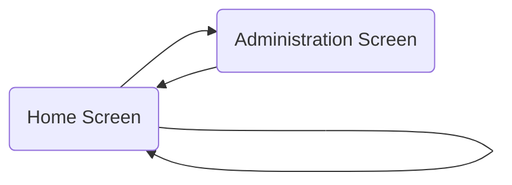
## Loading Screen
  
---
### Global variables
  
Following variables have been created / or updated on this screen
- StartLoadingScreenTimer
-         Color1TextJSON
-         varUser
-         Color3TextJSON
-         editMenu
- LoadingText
-         Color2TextJSON
-         Color3JSON
-         Color2JSON
-         defaultIconColor
-         TriggerFileSelector
-         Color1JSON
-         hideMenu

### 'Loading Screen' As screen

#### OnVisible


```typescript
=///////////////////////////////////////////////////////////////
//
//  Start the Loading Screen
//
//  This starts the Timer, which controls the progress bar
//
//  If the data Loads before the Progress bar finishes, then
//  the user will be happy, and if it finishes just after
//  the progress bar, then you've set their expectations
//  with the progress bar so they are likely to be more
//  accepting of that slight delay.
//
//  We also set the default loading Text here.
//  This text is then updated during each step
//  of the Data Loading process.
//
///////////////////////////////////////////////////////////////

Set(StartLoadingScreenTimer, false); Set(StartLoadingScreenTimer, true);
Set(LoadingText, "...");

///////////////////////////////////////////////////////////////
//
//  Data Loading is moved to the OnTimerStart
//
//  This guaratees that the navigate to the next screen
//  will only happen once the data has been completely loaded
//
//  The above may not apply to your situation and you may want
//  the navigate set to another timer if you don't need the
//  loaded data to be available during your Home Screen experience.
//
///////////////////////////////////////////////////////////////


```
## Home Screen
  
---
### Global variables
  
Following variables have been created / or updated on this screen
- newMyMenuID
- galDefault
- thisMenuID
- DownloadImage
- showCollection
- hideMenu
- iconicLight
- FileValue
- varRecord
- editMenu
- createNewMenu
- onReset
- bootstrapLight
- removeFav
- menuDefault
- newItem
- editMenu
- galDefault
- FileName
- galDefault
- createNewMenu
- editing
- addedtofav

### 'Home Screen' As screen

#### OnVisible


```typescript
=UpdateContext({varPageNumber:1});UpdateContext({icon_foreground_color:"#9E9FFF",icon_background_color:"#1B1D23",upload:false,FileValue:Blank(),icon_rotation:0,iconsort:Descending});
ClearCollect(col_myFavouriteIcons,Filter(MyFavouriteIcons,CreatorEmail = User().Email));
ClearCollect(col_temp,Sort(col_myFavouriteIcons,Name,Ascending));
UpdateContext(
        {
            selectedIconName: First(col_temp).Name,
            selectedIconSet: First(col_temp).IconSet
        }
    )
```
### gal_menu As gallery.galleryVertical

#### Items


```typescript
=Sort(fontmenu,ID,Ascending)
```
#### OnSelect


```typescript
=UpdateContext(
    {
        varPageNumber: 1,
        isSearching: false
    }
);
Reset(inp_search);
Clear(col_icons);
If(
    And(
        ThisItem.Expanded = false,
        ThisItem.ParentID = 0,
        ThisItem.SubItems = true
    ),
    Patch(
        fontmenu,
        ThisItem,
        {Expanded: true}
    );
    Collect(
        fontmenu,
        Filter(
            col_fontmenu_home,
            ParentID = ThisItem.ID
        )
    ),
    Patch(
        fontmenu,
        ThisItem,
        {Expanded: false}
    );
    Remove(
        fontmenu,
        Filter(
            col_fontmenu_home,
            ParentID = ThisItem.ID
        )
    );
    If(
        ThisItem.SubItems,
        Set(
            galDefault,
            ThisItem
        )
    )
);
Switch(
    ThisItem.MenuText,
    "Fluent UI",
    ClearCollect(
        col_icons,
        FluentUI
    ),
    "Material Design",
    ClearCollect(
        col_icons,
        MaterialDesign
    ),
    "Font Awesome",
    ClearCollect(
        col_icons,
        FontAwesome
    ),
    "Simple Icons",
    ClearCollect(
        col_icons,
        SimpleIcons
    ),
    "Game Icons",
    ClearCollect(
        col_icons,
        GameIcons
    ),
    "Remix",
    ClearCollect(
        col_icons,
        Remix
    ),
    "Bootstrap",
    ClearCollect(
        col_icons,
        Bootstrap
    ),
    "Tabler",
    ClearCollect(
        col_icons,
        Tabler
    ),
    "Teeny",
    ClearCollect(
        col_icons,
        Teeny
    ),
    "Feather",
    ClearCollect(
        col_icons,
        Feather
    ),
    "Crypto Icons",
    ClearCollect(
        col_icons,
        Crypto
    ),
    "Box",
    ClearCollect(
        col_icons,
        Box
    ),
    "Weather",
    ClearCollect(
        col_icons,
        Weather
    ),
    "Animated",
    ClearCollect(
        col_icons,
        WeatherAni
    ),
    "Public Domain",
    ClearCollect(
        col_icons,
        PublicDomains
    ),
    "Pixelart",
    ClearCollect(
        col_icons,
        PixelArt
    ),
    "Microsoft Graphics",
    ClearCollect(
        col_icons,
        MSIcons
    ),
    "VS Code",
    ClearCollect(
        col_icons,
        VSCode
    ),
    "Twemoji",
    ClearCollect(
        col_icons,
        Twemoji
    ),
    "La Capitaine",
    ClearCollect(
        col_icons,
        lacaptaine
    ),
    "Flags",
    ClearCollect(
        col_icons,
        flags
    ),
    "AzDevMDL2",
    ClearCollect(
        col_icons,
        AzDevMDL2
    ),
    "SegoeMDL2",
    ClearCollect(
        col_icons,
        SegoeMDL2
    ),
    "Icofont",
    ClearCollect(
        col_icons,
        Icofont
    ),
    "Bowtie",
    ClearCollect(
        col_icons,
        Bowtie
    ),
    "Octicons",
    ClearCollect(
        col_icons,
        Octicons
    ),
    "Hero",
    ClearCollect(
        col_icons,
        HeroIcons
    )
);
Switch(
    ThisItem.ID,1,
    UpdateContext(
        {
            selectedIconName: First(col_myFavouriteIcons).Name,
            selectedIconSet: First(col_myFavouriteIcons).IconSet
        }
    ),
    
    UpdateContext(
        {
            selectedIconName: First(col_icons).Name,
            selectedIconSet: First(col_icons).Set
        }
    )
)
```
### gal_MenuBuilder As gallery.galleryHorizontal

#### Items


```typescript
=//If(editMenu,Sort(Filter(MyMenuItems,Menu.Value = gal_MyMenus.Selected.Title),ItemID,Ascending),
Sort(newMenu,ItemID,Ascending)
```
### btn_hid_add_blank_item As button

#### OnSelect


```typescript
=Collect(newMenu,{ItemID: CountRows(newMenu)+1,MenuText:""})
```
#### Text


```typescript
=""
```
### Button3_1 As button

#### OnSelect


```typescript
=Set(editMenu,false);Clear(newMenu);Navigate('Home Screen',ScreenTransition.Fade)
```
#### Text


```typescript
=""
```
### Button3_8 As button

#### OnSelect


```typescript
=If(editMenu,Collect(MyMenuItems,newMenu);Set(createNewMenu,true), Set(createNewMenu,true));
```
#### Text


```typescript
=""
```
### selected_Icon As image

#### Image


```typescript
=If(
    upload,
    FileValue,
    If(
        gal_menu.Selected.MenuText = "My Favourites" And Not(isSearching),
        gal_myfavs.Selected.light_icon,
        gal_icons.Selected.ico_image
    )
)
/*If(
    upload,
    FileValue,
    Switch(
        gal_menu.Selected.MenuText,
        "My Favourites",
        Switch(
            gal_MyFavs_1.Selected.IconSet,
            "Bowtie",
            "data:image/svg+xml," & EncodeUrl(
                Substitute(
                    LookUp(
                        Bowtie,
                        Name = gal_MyFavs_1.Selected.Title
                    ).Icon,
                    "<path d",
                    "<path fill='" & gal_MyFavs_1.Selected.DarkColor & "' d"
                )
            ),
            "AzDevMDL2",
            "data:image/svg+xml," & EncodeUrl(
                Substitute(
                    LookUp(
                        AzDevMDL2,
                        Name = gal_MyFavs_1.Selected.Title
                    ).Icon,
                    "<path d",
                    "<path fill='" & gal_MyFavs_1.Selected.DarkColor & "' d"
                )
            ),
            "SegoeMDL2",
            "data:image/svg+xml," & EncodeUrl(
                Substitute(
                    LookUp(
                        SegoeMDL2,
                        Name = gal_MyFavs_1.Selected.Title
                    ).Icon,
                    "<path d",
                    "<path fill='" & gal_MyFavs_1.Selected.DarkColor & "' d"
                )
            ),
            "Icofont",
            "data:image/svg+xml," & EncodeUrl(
                Substitute(
                    LookUp(
                        Icofont,
                        Name = gal_MyFavs_1.Selected.Title
                    ).Icon,
                    "<path d",
                    "<path fill='" & gal_MyFavs_1.Selected.DarkColor & "' d"
                )
            ),
            "Fluent UI",
            "data:image/svg+xml," & EncodeUrl(
                Substitute(
                    LookUp(
                        FluentUI,
                        Name = gal_MyFavs_1.Selected.Title
                    ).Icon,
                    "path ",
                    "path fill='" & gal_MyFavs_1.Selected.DarkColor & "' "
                )
            ),
            "Public Domain",
            "data:image/svg+xml," & EncodeUrl(
                Substitute(
                    Substitute(
                        Substitute(
                            Substitute(
                                LookUp(
                                    PublicDomains,
                                    Name = gal_MyFavs_1.Selected.Title
                                ).Icon,
                                "path ",
                                "path fill='" & gal_MyFavs_1.Selected.DarkColor & "' "
                            ),
                            "ellipse",
                            "ellipse fill='" & gal_MyFavs_1.Selected.DarkColor & "'"
                        ),
                        "circle",
                        "circle fill='" & gal_MyFavs_1.Selected.DarkColor & "'"
                    ),
                    "stroke='#000'",
                    "stroke='" & gal_MyFavs_1.Selected.DarkColor & "'"
                )
            ),
            "Feather",
            "data:image/svg+xml," & EncodeUrl(
                Substitute(
                    LookUp(
                        Feather,
                        Name = gal_MyFavs_1.Selected.Title
                    ).Icon,
                    "stroke='currentColor'",
                    "stroke='" & gal_MyFavs_1.Selected.DarkColor & "'"
                )
            ),
            "Fluent UI",
            "data:image/svg+xml," & EncodeUrl(
                Substitute(
                    LookUp(
                        FluentUI,
                        Name = gal_MyFavs_1.Selected.Title
                    ).Icon,
                    "path",
                    "path fill='" & gal_MyFavs_1.Selected.DarkColor & "'"
                )
            ),
            "Bootstrap",
            "data:image/svg+xml," & EncodeUrl(
                Substitute(
                    LookUp(
                        Bootstrap,
                        Name = gal_MyFavs_1.Selected.Title
                    ).Icon,
                    "fill='currentColor'",
                    "fill='" & gal_MyFavs_1.Selected.DarkColor & "'"
                )
            ),
            "Material Design",
            "data:image/svg+xml," & EncodeUrl(
                Substitute(
                    LookUp(
                        MaterialDesign,
                        Name = gal_MyFavs_1.Selected.Title
                    ).Icon,
                    "path",
                    "path fill='" & gal_MyFavs_1.Selected.DarkColor & "'"
                )
            ),
            "Font Awesome",
            "data:image/svg+xml," & EncodeUrl(
                Substitute(
                    LookUp(
                        FontAwesome,
                        Name = gal_MyFavs_1.Selected.Title
                    ).Icon,
                    "path",
                    "path fill='" & gal_MyFavs_1.Selected.DarkColor & "'"
                )
            ),
            "Simple Icons",
            "data:image/svg+xml," & EncodeUrl(
                Substitute(
                    LookUp(
                        SimpleIcons,
                        Name = gal_MyFavs_1.Selected.Title
                    ).Icon,
                    "path",
                    "path fill='" & gal_MyFavs_1.Selected.DarkColor & "'"
                )
            ),
            "Octicons",
            "data:image/svg+xml," & EncodeUrl(
                Substitute(
                    LookUp(
                        Octicons,
                        Name = gal_MyFavs_1.Selected.Title
                    ).Icon,
                    "path",
                    "path fill='" & gal_MyFavs_1.Selected.DarkColor & "'"
                )
            ),
            "Weather",
            "data:image/svg+xml," & EncodeUrl(
                Substitute(
                    LookUp(
                        Weather,
                        Name = gal_MyFavs_1.Selected.Title
                    ).Icon,
                    "path",
                    "path fill='" & gal_MyFavs_1.Selected.DarkColor & "'"
                )
            ),
            "Public Domain",
            "data:image/svg+xml," & EncodeUrl(
                Substitute(
                    Substitute(
                        Substitute(
                            Substitute(
                                LookUp(
                                    PublicDomains,
                                    Name = gal_MyFavs_1.Selected.Title
                                ).Icon,
                                "path ",
                                "path fill='" & gal_MyFavs_1.Selected.DarkColor & "' "
                            ),
                            "ellipse",
                            "ellipse fill='" & gal_MyFavs_1.Selected.DarkColor & "'"
                        ),
                        "circle",
                        "circle fill='" & gal_MyFavs_1.Selected.DarkColor & "'"
                    ),
                    "stroke='#000'",
                    "stroke='" & gal_MyFavs_1.Selected.DarkColor & "'"
                )
            ),
            "Game Icons",
            "data:image/svg+xml," & EncodeUrl(
                Substitute(
                    LookUp(
                        GameIcons,
                        Name = gal_MyFavs_1.Selected.Title
                    ).Icon,
                    "#000",
                    gal_MyFavs_1.Selected.DarkColor
                )
            ),
            "Microsoft Graphics",
            "data:image/svg+xml," & EncodeUrl(
                LookUp(
                    MSIcons,
                    Name = gal_MyFavs_1.Selected.Title
                ).Icon
            ),
            "VS Code",
            "data:image/svg+xml," & EncodeUrl(
                LookUp(
                    VSCode,
                    Name = gal_MyFavs_1.Selected.Title
                ).Icon
            ),
            "Twemoji",
            "data:image/svg+xml," & EncodeUrl(
                LookUp(
                    Twemoji,
                    Name = gal_MyFavs_1.Selected.Title
                ).Icon
            ),
            "Flags",
            "data:image/svg+xml," & EncodeUrl(
                LookUp(
                    Flags_1.Flags,
                    Name = gal_MyFavs_1.Selected.Title
                ).Icon
            ),
            "Teeny",
            "data:image/svg+xml," & EncodeUrl(
                LookUp(
                    Teeny,
                    Name = gal_MyFavs_1.Selected.Title
                ).Icon
            ),
            "Remix",
            "data:image/svg+xml," & EncodeUrl(
                Substitute(
                    Substitute(
                        Substitute(
                            LookUp(
                                Remix,
                                Name = gal_MyFavs_1.Selected.Title
                            ).Icon,
                            "path d=",
                            "path fill='" & icon_foreground.inputValue & "' d="
                        ),
                        "path fill-rule='nonzero'",
                        "path fill='" & icon_foreground.inputValue & "' fill-rule='nonzero'"
                    ),
                    "circle=",
                    "fill='" & icon_foreground.inputValue & "' circle"
                )
            ),
            "Pixelart",
            "data:image/svg+xml," & EncodeUrl(
                Substitute(
                    Substitute(
                        LookUp(
                            PixelArt,
                            Name = gal_MyFavs_1.Selected.Title
                        ).Icon,
                        "fill='currentColor'",
                        "fill='" & icon_foreground.inputValue & "'"
                    ),
                    "stroke='#000'",
                    "stroke='" & icon_foreground.inputValue & "'"
                )
            ),
            "Tabler",
            "data:image/svg+xml," & EncodeUrl(
                Substitute(
                    Substitute(
                        Substitute(
                            Substitute(
                                Substitute(
                                    Substitute(
                                        Substitute(
                                            LookUp(
                                                Tabler,
                                                Name = gal_MyFavs_1.Selected.Title
                                            ).Icon,
                                            "path d=",
                                            "path stroke='" & icon_foreground.inputValue & "' d="
                                        ),
                                        "line x1=",
                                        "line stroke='" & icon_foreground.inputValue & "' x1="
                                    ),
                                    "circle cx=",
                                    "circle stroke='" & icon_foreground.inputValue & "' cx="
                                ),
                                "rect ",
                                "rect stroke='" & icon_foreground.inputValue & "' "
                            ),
                            "polyline points",
                            "polyline stroke='" & icon_foreground.inputValue & "' points"
                        ),
                        "ellipse ",
                        "ellipse stroke='" & icon_foreground.inputValue & "' "
                    ),
                    "currentColor",
                    icon_foreground.inputValue
                )
            )
        ),
        "Feather",
        "data:image/svg+xml," & EncodeUrl(
            Substitute(
                gal_icons.Selected.Icon,
                "stroke='currentColor'",
                "stroke='" & icon_foreground.inputValue & "'"
            )
        ),
        "Fluent UI",
        "data:image/svg+xml," & EncodeUrl(
            Substitute(
                Substitute(
                    gal_icons.Selected.Icon,
                    "fill='#212121'",
                    "fill='" & icon_foreground.inputValue & "'"
                ),
                "fill='none'",
                ""
            )
        ),
        "Bootstrap",
        "data:image/svg+xml," & EncodeUrl(
            Substitute(
                gal_icons.Selected.Icon,
                "fill='currentColor'",
                "fill='" & icon_foreground.inputValue & "'"
            )
        ),
        "Material Design",
        "data:image/svg+xml," & EncodeUrl(
            Substitute(
                gal_icons.Selected.Icon,
                "path",
                "path fill='" & icon_foreground.inputValue & "'"
            )
        ),
        "Teeny",
        "data:image/svg+xml," & EncodeUrl(
            Substitute(
                Substitute(
                    gal_icons.Selected.Icon,
                    "stroke='black'",
                    "stroke='" & icon_foreground.inputValue & "'"
                ),
                "fill='black'",
                "fill='" & icon_foreground.inputValue & "'"
            )
        ),
        "Font Awesome",
        "data:image/svg+xml," & EncodeUrl(
            Substitute(
                gal_icons.Selected.Icon,
                "path",
                "path fill='" & icon_foreground.inputValue & "'"
            )
        ),
        "Iconic",
        "data:image/svg+xml," & EncodeUrl(
            Substitute(
                gal_icons.Selected.Icon,
                "path",
                "path fill='" & icon_foreground.inputValue & "'"
            )
        ),
        "Simple Icons",
        "data:image/svg+xml," & EncodeUrl(
            Substitute(
                gal_icons.Selected.Icon,
                "path",
                "path fill='" & icon_foreground.inputValue & "'"
            )
        ),
        "Octicons",
        "data:image/svg+xml," & EncodeUrl(
            Substitute(
                gal_icons.Selected.Icon,
                "path",
                "path fill='" & icon_foreground.inputValue & "'"
            )
        ),
        "Microsoft Graphics",
        "data:image/svg+xml," & EncodeUrl(gal_icons.Selected.Icon),
        "VS Code",
        "data:image/svg+xml," & EncodeUrl(gal_icons.Selected.Icon),
        "Twemoji",
        "data:image/svg+xml," & EncodeUrl(gal_icons.Selected.Icon),
        "Weather Animated",
        "data:image/svg+xml," & EncodeUrl(gal_icons.Selected.Icon),
        "Flags",
        "data:image/svg+xml," & EncodeUrl(gal_icons.Selected.Icon),
        "La Capitaine",
        "data:image/svg+xml," & EncodeUrl(gal_icons.Selected.Icon),
        "Weather",
        "data:image/svg+xml," & EncodeUrl(
            Substitute(
                gal_icons.Selected.Icon,
                "path",
                "path fill='" & icon_foreground.inputValue & "'"
            )
        ),
        "Public Domain",
        "data:image/svg+xml," & EncodeUrl(
            Substitute(
                Substitute(
                    Substitute(
                        Substitute(
                            Substitute(
                                gal_icons.Selected.Icon,
                                "path ",
                                "path fill='" & icon_foreground.inputValue & "' "
                            ),
                            "ellipse",
                            "ellipse fill='" & icon_foreground.inputValue & "'"
                        ),
                        "circle",
                        "circle fill='" & icon_foreground.inputValue & "'"
                    ),
                    "stroke='#000'",
                    "stroke='" & icon_foreground.inputValue & "'"
                ),
                "fill='#010101'",
                "fill='" & icon_foreground.inputValue & "'"
            )
        ),
        "Eva",
        "data:image/svg+xml," & EncodeUrl(
            Substitute(
                gal_icons.Selected.Icon,
                "#231f20",
                icon_foreground.inputValue
            )
        ),
        "Game Icons",
        "data:image/svg+xml," & EncodeUrl(
            Substitute(
                gal_icons.Selected.Icon,
                "#000",
                icon_foreground.inputValue
            )
        ),
        "Weather",
        "data:image/svg+xml," & EncodeUrl(
            Substitute(
                gal_icons.Selected.Icon,
                "path d",
                "path fill='" & icon_foreground.inputValue & "' d"
            )
        ),
        "Remix",
        "data:image/svg+xml," & EncodeUrl(
            Substitute(
                Substitute(
                    Substitute(
                        gal_icons.Selected.Icon,
                        "path d=",
                        "path fill='" & icon_foreground.inputValue & "' d="
                    ),
                    "path fill-rule='nonzero'",
                    "path fill='" & icon_foreground.inputValue & "' fill-rule='nonzero'"
                ),
                "circle=",
                "fill='" & icon_foreground.inputValue & "' circle"
            )
        ),
        "Pixelart",
        "data:image/svg+xml," & EncodeUrl(
            Substitute(
                Substitute(
                    gal_icons.Selected.Icon,
                    "fill='currentColor'",
                    "fill='" & icon_foreground.inputValue & "'"
                ),
                "stroke='#000'",
                "stroke='" & icon_foreground.inputValue & "'"
            )
        ),
        "Tabler",
        "data:image/svg+xml," & EncodeUrl(
            Substitute(
                Substitute(
                    Substitute(
                        Substitute(
                            Substitute(
                                Substitute(
                                    Substitute(
                                        gal_icons.Selected.Icon,
                                        "path d=",
                                        "path stroke='" & icon_foreground.inputValue & "' d="
                                    ),
                                    "line x1=",
                                    "line stroke='" & icon_foreground.inputValue & "' x1="
                                ),
                                "circle cx=",
                                "circle stroke='" & icon_foreground.inputValue & "' cx="
                            ),
                            "rect ",
                            "rect stroke='" & icon_foreground.inputValue & "' "
                        ),
                        "polyline points",
                        "polyline stroke='" & icon_foreground.inputValue & "' points"
                    ),
                    "ellipse ",
                    "ellipse stroke='" & icon_foreground.inputValue & "' "
                ),
                "currentColor",
                icon_foreground.inputValue
            )
        ),
        "AzDevMDL2",
        "data:image/svg+xml," & EncodeUrl(
            Substitute(
                gal_icons.Selected.Icon,
                "<path d",
                "<path fill='" & icon_foreground.inputValue & "' d"
            )
        ),
        "SegoeMDL2",
        "data:image/svg+xml," & EncodeUrl(
            Substitute(
                gal_icons.Selected.Icon,
                "<path d",
                "<path fill='" & icon_foreground.inputValue & "' d"
            )
        ),
        "Icofont",
        "data:image/svg+xml," & EncodeUrl(
            Substitute(
                gal_icons.Selected.Icon,
                "<path d",
                "<path fill='" & icon_foreground.inputValue & "' d"
            )
        ),
        "Bowtie",
        "data:image/svg+xml," & EncodeUrl(
            Substitute(
                gal_icons.Selected.Icon,
                "<path d",
                "<path fill='" & icon_foreground.inputValue & "' d"
            )
        )
    )
)*/
```
### iconImageData As text

### add_fav_1 As image

#### Image


```typescript
="data:image/svg+xml," & EncodeUrl("<svg width='24' height='24' viewBox='0 0 24 24' xmlns='http://www.w3.org/2000/svg'><path fill=' If(encodeImage,  "#006600", Mid(Color3JSON,2,7)) ' d='M8.09 18.61l6-14a1 1 0 011.87.67l-.04.11-6 14a1 1 0 01-1.87-.67l.04-.1 6-14.01-6 14zm-5.8-7.32l4-4a1 1 0 011.5 1.32l-.08.1L4.4 12l3.3 3.3a1 1 0 01-1.32 1.5l-.1-.1-4-4a1 1 0 01-.08-1.31l.08-.1 4-4-4 4zm14-4a1 1 0 011.32-.08l.1.08 4 4a1 1 0 01.08 1.32l-.08.1-4 4a1 1 0 01-1.5-1.33l.08-.1L19.6 12l-3.3-3.3a1 1 0 010-1.4z'/></svg>")
```
#### OnSelect


```typescript
=UpdateContext({encodeImage:false})
```
### add_fav As image

#### Image


```typescript
=If(
    CountRows(
        Filter(
            col_myFavouriteIcons,
            Title = lbl_IconName.Text And IconSet = lbl_IconSet.Text
        )
    ) > 0,
    "data:image/svg+xml," & EncodeUrl("<svg width='24' height='24' viewBox='0 0 24 24' xmlns='http://www.w3.org/2000/svg'><path fill=' If(add_fav.DisplayMode = DisplayMode.Disabled,"#cccccc","#e00837") ' d='M12.82 5.58L12 6.4l-.82-.82a5.37 5.37 0 10-7.6 7.6l7.89 7.9c.3.29.77.29 1.06 0l7.9-7.9a5.38 5.38 0 10-7.61-7.6z'/></svg>"),
    "data:image/svg+xml," & EncodeUrl(
        "<svg width='24' height='24' viewBox='0 0 24 24' xmlns='http://www.w3.org/2000/svg'><path fill='" & If(Not(IsBlank(selected_Icon.Image)),
            If(add_fav.DisplayMode = DisplayMode.Disabled,"#cccccc","#e00837"),
            Mid(
                Color1JSON,
                2,
                7
            )
        ) & "' d='M12.82 5.58L12 6.4l-.82-.82a5.37 5.37 0 10-7.6 7.6l7.89 7.9c.3.29.77.29 1.06 0l7.9-7.9a5.38 5.38 0 10-7.61-7.6zm6.55 6.54L12 19.48l-7.36-7.36a3.87 3.87 0 115.48-5.48L11.47 8c.3.3.79.29 1.08-.02l1.33-1.34a3.88 3.88 0 015.49 5.48z'/></svg>"
    )
)
```
#### OnSelect


```typescript
=If(
    CountRows(
        Filter(
            col_myFavouriteIcons,
            Title = lbl_IconName.Text And IconSet = lbl_IconSet.Text
        )
    ) > 0,
    Set(
        removeFav,
        RemoveIf(
            MyFavouriteIcons,
            IconSet = lbl_IconSet.Text,
            Title = lbl_IconName.Text
        )
    );
    If(
        !IsBlank(removeFav),
        Notify(
            "Removed from favourites!",
            NotificationType.Success,
            2000
        ),
        Notify(
            "There was an error removing favorite!",
            NotificationType.Error,
            2000
        )
    );
    ,
    Set(
        addedtofav,
        Patch(
            MyFavouriteIcons,
            Defaults(MyFavouriteIcons),
            {
                Title: lbl_IconName.Text,
                IconSet: lbl_IconSet.Text,
                LightColor: icon_background.inputValue,
                DarkColor: icon_foreground.inputValue,
                CreatorEmail: varUser.Email
            }
        )
    );
    If(
        !IsBlank(addedtofav),
        Notify(
            "Added to favourites!",
            NotificationType.Success,
            2000
        ),
        Notify(
            "There was an error saving favorite!",
            NotificationType.Error,
            2000
        )
    );
    
);
ClearCollect(
    col_myFavouriteIcons,
    MyFavouriteIcons
);

```
### selected_Icon_1 As image

#### Image


```typescript
=selected_Icon.Image
```
### selected_Icon_2 As image

#### Image


```typescript
=selected_Icon.Image
```
### selected_Icon_3 As image

#### Image


```typescript
=selected_Icon.Image
```
### selected_Icon_4 As image

#### Image


```typescript
=selected_Icon.Image
```
### Button3_2 As button

#### OnSelect


```typescript
=UpdateContext({encodeImage:!encodeImage})
```
#### Text


```typescript
=""
```
### Button3_3 As button

#### OnSelect


```typescript
=Collect(
    newMenu,
    Table(
        {
            Title: gal_icons.Selected.Set,
            ItemID: CountRows(newMenu) + 1,
            ParentItem: 0,
            Expanded: false,
            Screen: "",
            SubItems: false,
            MenuText: lbl_IconName.Text,
            Tab: gal_icons.Selected.Name,
            Icon: gal_icons.Selected.Icon,
            DarkIcon: gal_icons.Selected.Icon,
            DarkColor: icon_foreground.inputValue,
            LightColor: icon_background.inputValue
        }
    )
);
Set(
    onReset,
    true
);

```
#### Text


```typescript
=""
```
### Button3_4 As button

#### OnSelect


```typescript
=If(
    CountRows(
        Filter(
            col_myFavouriteIcons,
            Title = lbl_IconName.Text And IconSet = lbl_IconSet.Text
        )
    ) > 0,
    Set(
        removeFav,
        RemoveIf(
            MyFavouriteIcons,
            IconSet = lbl_IconSet.Text,
            Title = lbl_IconName.Text
        )
    );
    If(
        !IsBlank(removeFav),
        Notify(
            "Removed from favourites!",
            NotificationType.Success,
            2000
        ),
        Notify(
            "There was an error removing favorite!",
            NotificationType.Error,
            2000
        )
    );
    ,
    Set(
        addedtofav,
        Patch(
            MyFavouriteIcons,
            Defaults(MyFavouriteIcons),
            {
                Title: lbl_IconName.Text,
                IconSet: lbl_IconSet.Text,
                LightColor: icon_background.inputValue,
                DarkColor: icon_foreground.inputValue,
                CreatorEmail: varUser.Email
            }
        )
    );
    If(
        !IsBlank(addedtofav),
        Notify(
            "Added to favourites!",
            NotificationType.Success,
            2000
        ),
        Notify(
            "There was an error saving favorite!",
            NotificationType.Error,
            2000
        )
    );
    
);
ClearCollect(
    col_myFavouriteIcons,
    MyFavouriteIcons
);

```
#### Text


```typescript
=""
```
### Button3_5 As button

#### OnSelect


```typescript
=Set(DownloadImage,true)
```
#### Text


```typescript
=""
```
### Image1 As image

#### Image


```typescript
="data:image/svg+xml," & EncodeUrl("<svg width='32' height='32' viewBox='0 0 32 32' fill='none' xmlns='http://www.w3.org/2000/svg'> <path fill=' Mid(Color3TextJSON,2,7) & "' d='M16 11C13.2386 11 11 13.2386 11 16C11 18.7614 13.2386 21 16 21C18.7614 21 21 18.7614 21 16C21 13.2386 18.7614 11 16 11ZM13 16C13 14.3431 14.3431 13 16 13C17.6569 13 19 14.3431 19 16C19 17.6569 17.6569 19 16 19C14.3431 19 13 17.6569 13 16ZM12.8403 29.628C13.8754 29.8753 14.936 30.0002 16.0003 30C17.0633 29.9984 18.1225 29.8725 19.1563 29.625C19.4531 29.5548 19.721 29.3945 19.9231 29.166C20.1252 28.9376 20.2518 28.6522 20.2853 28.349L20.5202 26.219C20.5538 25.868 20.7123 25.5408 20.9669 25.2968C21.2214 25.0529 21.5551 24.9085 21.9072 24.89C22.1404 24.8802 22.3727 24.924 22.5863 25.018L24.5412 25.875C24.728 25.9571 24.9297 25.9995 25.1337 25.9995C25.3377 25.9995 25.5395 25.9571 25.7262 25.875C25.9104 25.7949 26.0759 25.6774 26.2123 25.53C27.6568 23.9736 28.735 22.1139 29.3682 20.087C29.4589 19.7938 29.4561 19.4797 29.3602 19.1882C29.2644 18.8967 29.0802 18.6422 28.8333 18.46L27.1043 17.185C26.8196 16.9778 26.618 16.676 26.5357 16.3337C26.4535 15.9914 26.4958 15.6309 26.6553 15.317C26.7622 15.1078 26.917 14.9269 27.1073 14.789L28.8273 13.518C29.0757 13.3364 29.2611 13.0815 29.3574 12.7892C29.4537 12.4969 29.4561 12.1817 29.3642 11.888C28.7321 9.86076 27.6533 8.00111 26.2073 6.44598C25.9982 6.22242 25.7249 6.0692 25.4251 6.00742C25.1253 5.94563 24.8137 5.97831 24.5332 6.10098L22.5873 6.957C22.374 7.04998 22.1418 7.09146 21.9095 7.07809C21.6772 7.06473 21.4513 6.99689 21.2501 6.88007C21.0488 6.76324 20.8779 6.60071 20.7511 6.40561C20.6244 6.21051 20.5453 5.98832 20.5202 5.75699L20.2843 3.63699C20.2513 3.33005 20.1228 3.04118 19.9171 2.81104C19.7113 2.58089 19.4386 2.42105 19.1372 2.354C18.1104 2.12457 17.0624 2.0029 16.0102 1.991C14.9519 2.00352 13.8976 2.12517 12.8642 2.354C12.5623 2.42036 12.289 2.58029 12.0833 2.811C11.8771 3.03957 11.7488 3.32779 11.7172 3.634L11.4802 5.75598C11.4543 5.98766 11.3746 6.21006 11.2473 6.40536C11.12 6.60067 10.9488 6.76345 10.7473 6.88068C10.5458 6.9979 10.3196 7.06633 10.0869 7.08044C9.85422 7.09456 9.62145 7.05401 9.40725 6.96201L7.46126 6.10498C7.27614 6.02606 7.07698 5.98541 6.87574 5.98541C6.67451 5.98541 6.47536 6.02606 6.29025 6.10498C6.1005 6.18461 5.93001 6.30396 5.79025 6.45499C4.34425 8.01199 3.26489 9.87278 2.63125 11.901C2.54103 12.194 2.54415 12.5078 2.64018 12.799C2.73621 13.0901 2.92041 13.3442 3.16725 13.526L4.89225 14.798C5.17575 15.0066 5.37612 15.3089 5.45778 15.6513C5.53943 15.9937 5.49709 16.3539 5.33825 16.668C5.2334 16.8765 5.08054 17.0571 4.89225 17.195L3.16725 18.47C2.91967 18.6521 2.73507 18.9069 2.63917 19.1989C2.54327 19.4909 2.54085 19.8056 2.63224 20.099C3.26559 22.1285 4.34496 23.9907 5.79126 25.549C5.92796 25.6955 6.0934 25.8123 6.27725 25.892C6.46402 25.9727 6.66532 26.0143 6.86876 26.0143C7.0722 26.0143 7.27348 25.9727 7.46025 25.892L9.41525 25.033C9.62848 24.9409 9.86036 24.9 10.0922 24.9138C10.3241 24.9276 10.5495 24.9955 10.7504 25.1122C10.9512 25.229 11.1219 25.3911 11.2486 25.5858C11.3754 25.7804 11.4547 26.0021 11.4802 26.233L11.7153 28.359C11.7496 28.6605 11.876 28.9441 12.0773 29.1712C12.2786 29.3983 12.545 29.5578 12.8403 29.628ZM18.3413 27.762C16.7983 28.0785 15.2072 28.0785 13.6643 27.762L13.4693 26.022C13.374 25.1708 12.9681 24.3846 12.3292 23.814C11.8291 23.3736 11.2147 23.0836 10.5568 22.9775C9.89898 22.8713 9.22451 22.9533 8.61125 23.214L7.00525 23.914C5.96924 22.7277 5.17199 21.3525 4.65725 19.864L6.08125 18.812C6.52119 18.4878 6.8788 18.0648 7.12526 17.5771C7.37171 17.0893 7.50012 16.5505 7.50012 16.004C7.50012 15.4575 7.37171 14.9187 7.12526 14.4309C6.8788 13.9432 6.52119 13.5202 6.08125 13.196L4.65925 12.147C5.17459 10.66 5.9718 9.2862 7.00725 8.10098L8.60725 8.80099C9.04825 8.99573 9.52516 9.09589 10.0072 9.095C10.8657 9.09231 11.6933 8.77419 12.3325 8.20114C12.9718 7.62809 13.3781 6.84009 13.4743 5.987L13.6683 4.23999C14.4419 4.09044 15.2273 4.01013 16.0152 4C16.7972 4.00992 17.5766 4.08989 18.3443 4.23898L18.5313 5.979C18.6237 6.833 19.0286 7.62264 19.6683 8.19598C20.1687 8.63894 20.7848 8.93054 21.4447 9.03677C22.1045 9.143 22.781 9.05949 23.3952 8.79599L24.9953 8.09601C26.0318 9.281 26.8294 10.6552 27.3442 12.143L25.9223 13.189C25.4801 13.512 25.1203 13.9349 24.8724 14.4232C24.6244 14.9115 24.4951 15.4514 24.4951 15.999C24.4951 16.5466 24.6244 17.0865 24.8724 17.5748C25.1203 18.0631 25.4801 18.4859 25.9223 18.809L27.3442 19.858C26.8292 21.3437 26.0334 22.7166 25.0003 23.902L23.4002 23.202C22.8996 22.9792 22.3534 22.878 21.8062 22.9067C21.259 22.9354 20.7264 23.0932 20.2518 23.3671C19.7773 23.6411 19.3742 24.0234 19.0757 24.4829C18.7772 24.9424 18.5917 25.4661 18.5343 26.011L18.3413 27.762Z' /> </svg>")
```
#### OnSelect


```typescript
=Navigate('Administration Screen')
```
### img_next As image

#### Image


```typescript
=If(img_next_last.DisplayMode = DisplayMode.Disabled,"data:image/svg+xml," & EncodeUrl("<svg width='24' height='24' viewBox='0 0 24 24' fill='none' xmlns='http://www.w3.org/2000/svg'> <path d='M3 4.753C3 3.34519 4.57781 2.51363 5.73916 3.30937L16.2376 10.5028C17.2478 11.1949 17.253 12.6839 16.2477 13.3831L5.7492 20.6847C4.58887 21.4917 3 20.6613 3 19.248V4.753ZM4.89131 4.54677C4.7254 4.43309 4.5 4.55189 4.5 4.753V19.248C4.5 19.4499 4.72698 19.5685 4.89274 19.4532L15.3912 12.1517C15.5348 12.0518 15.5341 11.8391 15.3898 11.7402L4.89131 4.54677ZM20.9999 3.75C20.9999 3.33579 20.6641 3 20.2499 3C19.8357 3 19.4999 3.33579 19.4999 3.75V20.25C19.4999 20.6642 19.8357 21 20.2499 21C20.6641 21 20.9999 20.6642 20.9999 20.25V3.75Z' fill='#383C84'/> </svg>"),
"data:image/svg+xml," & EncodeUrl("<svg width='24' height='24' viewBox='0 0 24 24' fill='none' xmlns='http://www.w3.org/2000/svg'> <path d='M3 4.753C3 3.34519 4.57781 2.51363 5.73916 3.30937L16.2376 10.5028C17.2478 11.1949 17.253 12.6839 16.2477 13.3831L5.7492 20.6847C4.58887 21.4917 3 20.6613 3 19.248V4.753ZM4.89131 4.54677C4.7254 4.43309 4.5 4.55189 4.5 4.753V19.248C4.5 19.4499 4.72698 19.5685 4.89274 19.4532L15.3912 12.1517C15.5348 12.0518 15.5341 11.8391 15.3898 11.7402L4.89131 4.54677ZM20.9999 3.75C20.9999 3.33579 20.6641 3 20.2499 3C19.8357 3 19.4999 3.33579 19.4999 3.75V20.25C19.4999 20.6642 19.8357 21 20.2499 21C20.6641 21 20.9999 20.6642 20.9999 20.25V3.75Z' fill=' Mid(Color3TextJSON,2,7)'/> </svg>"))
```
#### OnSelect


```typescript
=UpdateContext({varPageNumber: varPageNumber + 1})
```
### img_prev As image

#### Image


```typescript
=If(img_prev.DisplayMode = DisplayMode.Disabled,
"data:image/svg+xml," & EncodeUrl("<svg width='24' height='24' viewBox='0 0 24 24' fill='none' xmlns='http://www.w3.org/2000/svg'> <path d='M20.9999 4.753C20.9999 3.34519 19.4221 2.51363 18.2607 3.30937L7.76228 10.5028C6.7521 11.1949 6.74691 12.6839 7.75223 13.3831L18.2507 20.6847C19.411 21.4917 20.9999 20.6613 20.9999 19.248V4.753ZM19.1086 4.54677C19.2745 4.43309 19.4999 4.55189 19.4999 4.753V19.248C19.4999 19.4499 19.2729 19.5685 19.1072 19.4532L8.60869 12.1517C8.46507 12.0518 8.46581 11.8391 8.61013 11.7402L19.1086 4.54677ZM3 3.75C3 3.33579 3.33579 3 3.75 3C4.16421 3 4.5 3.33579 4.5 3.75V20.25C4.5 20.6642 4.16421 21 3.75 21C3.33579 21 3 20.6642 3 20.25V3.75Z' fill='#383C84'/> </svg>"),
"data:image/svg+xml," & EncodeUrl("<svg width='24' height='24' viewBox='0 0 24 24' fill='none' xmlns='http://www.w3.org/2000/svg'> <path d='M20.9999 4.753C20.9999 3.34519 19.4221 2.51363 18.2607 3.30937L7.76228 10.5028C6.7521 11.1949 6.74691 12.6839 7.75223 13.3831L18.2507 20.6847C19.411 21.4917 20.9999 20.6613 20.9999 19.248V4.753ZM19.1086 4.54677C19.2745 4.43309 19.4999 4.55189 19.4999 4.753V19.248C19.4999 19.4499 19.2729 19.5685 19.1072 19.4532L8.60869 12.1517C8.46507 12.0518 8.46581 11.8391 8.61013 11.7402L19.1086 4.54677ZM3 3.75C3 3.33579 3.33579 3 3.75 3C4.16421 3 4.5 3.33579 4.5 3.75V20.25C4.5 20.6642 4.16421 21 3.75 21C3.33579 21 3 20.6642 3 20.25V3.75Z' fill=' Mid(Color3TextJSON,2,7)'/> </svg>")) 
```
#### OnSelect


```typescript
=UpdateContext({varPageNumber: varPageNumber - 1})
```
### img_prev_first As image

#### Image


```typescript
=If(img_prev_first.DisplayMode = DisplayMode.Disabled,
"data:image/svg+xml," & EncodeUrl("<svg width='24' height='24' viewBox='0 0 24 24'  xmlns='http://www.w3.org/2000/svg'> <path d='M12.5007 5.50338C12.5007 4.22433 11.0026 3.53209 10.0285 4.36107L2.61872 10.6673C1.79765 11.3661 1.79767 12.6339 2.61875 13.3327L10.0285 19.6386C11.0026 20.4676 12.5007 19.7753 12.5007 18.4963V14.5086L18.5295 19.6392C19.5035 20.4682 21.0016 19.7759 21.0016 18.4969V5.504C21.0016 4.22495 19.5035 3.53272 18.5295 4.3617L12.5007 9.49258V5.50338ZM12.5007 12.5389V11.4623L19.5016 5.504V18.4969L12.5007 12.5389ZM3.5909 11.8096L11.0007 5.50338V18.4963L3.5909 12.1904C3.47361 12.0905 3.4736 11.9094 3.5909 11.8096Z' fill='#383C84'/> </svg>"),
"data:image/svg+xml," & EncodeUrl("<svg width='24' height='24' viewBox='0 0 24 24'  xmlns='http://www.w3.org/2000/svg'> <path d='M12.5007 5.50338C12.5007 4.22433 11.0026 3.53209 10.0285 4.36107L2.61872 10.6673C1.79765 11.3661 1.79767 12.6339 2.61875 13.3327L10.0285 19.6386C11.0026 20.4676 12.5007 19.7753 12.5007 18.4963V14.5086L18.5295 19.6392C19.5035 20.4682 21.0016 19.7759 21.0016 18.4969V5.504C21.0016 4.22495 19.5035 3.53272 18.5295 4.3617L12.5007 9.49258V5.50338ZM12.5007 12.5389V11.4623L19.5016 5.504V18.4969L12.5007 12.5389ZM3.5909 11.8096L11.0007 5.50338V18.4963L3.5909 12.1904C3.47361 12.0905 3.4736 11.9094 3.5909 11.8096Z' fill=' Mid(Color3TextJSON,2,7)'/> </svg>"))
```
#### OnSelect


```typescript
=UpdateContext({varPageNumber: 1})
```
### img_next_last As image

#### Image


```typescript
=If(img_next_last.DisplayMode = DisplayMode.Disabled,"data:image/svg+xml," & EncodeUrl("<svg width='24' height='24' viewBox='0 0 24 24'  xmlns='http://www.w3.org/2000/svg'> <path d='M11.5 5.50289C11.5 4.22384 12.9981 3.5316 13.9722 4.36058L21.3819 10.6668C22.203 11.3656 22.203 12.6334 21.3819 13.3322L13.9721 19.6381C12.9981 20.4671 11.5 19.7748 11.5 18.4958V14.5091L5.47215 19.639C4.4981 20.4679 3 19.7757 3 18.4966V5.50373C3 4.22468 4.49813 3.53244 5.47218 4.36142L11.5 9.49148V5.50289ZM11.5 11.4612L4.5 5.50373V18.4966L11.5 12.5395V11.4612ZM20.4098 11.8091L13 5.50289V18.4958L20.4098 12.1899C20.5271 12.0901 20.5271 11.9089 20.4098 11.8091Z' fill='#383C84'/> </svg>"),
"data:image/svg+xml," & EncodeUrl("<svg width='24' height='24' viewBox='0 0 24 24'  xmlns='http://www.w3.org/2000/svg'> <path d='M11.5 5.50289C11.5 4.22384 12.9981 3.5316 13.9722 4.36058L21.3819 10.6668C22.203 11.3656 22.203 12.6334 21.3819 13.3322L13.9721 19.6381C12.9981 20.4671 11.5 19.7748 11.5 18.4958V14.5091L5.47215 19.639C4.4981 20.4679 3 19.7757 3 18.4966V5.50373C3 4.22468 4.49813 3.53244 5.47218 4.36142L11.5 9.49148V5.50289ZM11.5 11.4612L4.5 5.50373V18.4966L11.5 12.5395V11.4612ZM20.4098 11.8091L13 5.50289V18.4958L20.4098 12.1899C20.5271 12.0901 20.5271 11.9089 20.4098 11.8091Z' fill=' Mid(Color3TextJSON,2,7)'/> </svg>"))
```
#### OnSelect


```typescript
=UpdateContext(
    {
        varPageNumber: RoundUp(
                CountRows(col_icons) / ddPageSize.SelectedText.Value,
                0
            )
    }
)
```
### gal_icons As gallery.galleryVertical

#### Items


```typescript
=If(
    varPageNumber = 1,
    FirstN(
       Sort( col_icons,Name,iconsort),
        ddPageSize.SelectedText.Value * varPageNumber
    ),
    LastN(
        FirstN(
            Sort( col_icons,Name,iconsort),
            ddPageSize.SelectedText.Value * varPageNumber
        ),
        ddPageSize.SelectedText.Value * 1
    )
)
```
#### OnSelect


```typescript
=UpdateContext({selectedIconName:ThisItem.Name,selectedIconSet:ThisItem.Set})
```
### gal_mymenus As gallery.galleryVertical

#### Items


```typescript
=Search(col_MyMenus,inp_search_menu.Text,"{Name}")
```
#### OnSelect


```typescript
=ClearCollect(col_MyMenuItems,Filter(MyMenuItems, Menu.Value = ThisItem.'{Name}'))
```
### gal_menuitems As gallery.galleryVertical

#### Items


```typescript
=Sort(col_MyMenuItems,ItemID,Ascending)
```
### gal_myfavs As gallery.galleryVertical

#### Items


```typescript
=Sort(
    Search(
        Filter(
            col_myFavouriteIcons,
            Upper('Created By'.Email) = Upper(User().Email)
        ),
        inp_search.Text,
        "Title"
    ),
    Name,
    Ascending
)
```
#### OnSelect


```typescript
=UpdateContext({selectedIconName:ThisItem.Name,selectedIconSet:ThisItem.IconSet})
```
### frm_menu_item As form

#### DataSource


```typescript
=MyMenuItems
```
#### Item


```typescript
=gal_menuitems.Selected
```
### Image10 As image

#### Image


```typescript
= Switch(
        ThisItem.Title,
        "Feather",
        "data:image/svg+xml," & EncodeUrl(
            Substitute(
                ThisItem.Icon,
                "stroke='currentColor'",
                "stroke='" & icon_background.inputValue & "'"
            )
        ),
        "FluentUI",
        "data:image/svg+xml," & EncodeUrl(
            Substitute(
                Substitute(
                    ThisItem.Icon,
                    "fill='#212121'",
                    "fill='" & icon_background.inputValue & "'"
                ),
                "fill='none'",
                ""
            )
        ),
        "Bootstrap",
        "data:image/svg+xml," & EncodeUrl(
            Substitute(
                ThisItem.Icon,
                "fill='currentColor'",
                "fill='" & icon_background.inputValue & "'"
            )
        ),
        "MaterialDesign",
        "data:image/svg+xml," & EncodeUrl(
            Substitute(
                ThisItem.Icon,
                "path",
                "path fill='" & icon_background.inputValue & "'"
            )
        ),
        "Teeny",
        "data:image/svg+xml," & EncodeUrl(
            Substitute(
                Substitute(
                    ThisItem.Icon,
                    "stroke='black'",
                    "stroke='" & icon_background.inputValue & "'"
                ),
                "fill='black'",
                "fill='" & icon_background.inputValue & "'"
            )
        ),
        "FontAwesome",
        "data:image/svg+xml," & EncodeUrl(
            Substitute(
                ThisItem.Icon,
                "path",
                "path fill='" & icon_background.inputValue & "'"
            )
        ),
        "SimpleIcons",
        "data:image/svg+xml," & EncodeUrl(
            Substitute(
                ThisItem.Icon,
                "path",
                "path fill='" & icon_background.inputValue & "'"
            )
        ),
        "Octicons",
        "data:image/svg+xml," & EncodeUrl(
            Substitute(
                ThisItem.Icon,
                "path",
                "path fill='" & icon_background.inputValue & "'"
            )
        ),
        "Box",
        "data:image/svg+xml," & EncodeUrl(
            Substitute(
                ThisItem.Icon,
                "path",
                "path fill='" & icon_background.inputValue & "'"
            )
        ),
        "Hero",
        "data:image/svg+xml," & EncodeUrl(
            Substitute(
                ThisItem.Icon,
                "path",
                "path fill='" & icon_background.inputValue & "'"
            )
        ),
        "MSIcons",
        "data:image/svg+xml," & EncodeUrl(ThisItem.Icon),
        "VSCode",
        "data:image/svg+xml," & EncodeUrl(ThisItem.Icon),
        "Twemoji",
        "data:image/svg+xml," & EncodeUrl(ThisItem.Icon),
        "Crypto",
        "data:image/svg+xml," & EncodeUrl(ThisItem.Icon),
        "animation",
        "data:image/svg+xml," & EncodeUrl(ThisItem.Icon),
        "Flags",
        "data:image/svg+xml," & EncodeUrl(ThisItem.Icon),
        "lacap",
        "data:image/svg+xml," & EncodeUrl(ThisItem.Icon),
        "Weather",
        "data:image/svg+xml," & EncodeUrl(
            Substitute(
                ThisItem.Icon,
                "path",
                "path fill='" & icon_background.inputValue & "'"
            )
        ),
        "PublicDomain",
        "data:image/svg+xml," & EncodeUrl(
            Substitute(
                Substitute(
                    Substitute(
                        Substitute(
                            Substitute(
                                ThisItem.Icon,
                                "path ",
                                "path fill='" & icon_background.inputValue & "' "
                            ),
                            "ellipse",
                            "ellipse fill='" & icon_background.inputValue & "'"
                        ),
                        "circle",
                        "circle fill='" & icon_background.inputValue & "'"
                    ),
                    "stroke='#000'",
                    "stroke='" & icon_background.inputValue & "'"
                ),
                "fill='#010101'",
                "fill='" & icon_background.inputValue & "'"
            )
        ),
        "GameIcons",
        "data:image/svg+xml," & EncodeUrl(
            Substitute(
                ThisItem.Icon,
                "#000",
                icon_background.inputValue
            )
        ),
        "Remix",
        "data:image/svg+xml," & EncodeUrl(
            Substitute(
                Substitute(
                    Substitute(
                        ThisItem.Icon,
                        "path d=",
                        "path fill='" & icon_background.inputValue & "' d="
                    ),
                    "path fill-rule='nonzero'",
                    "path fill='" & icon_background.inputValue & "' fill-rule='nonzero'"
                ),
                "circle=",
                "fill='" & icon_background.inputValue & "' circle"
            )
        ),
        "Pixelart",
        "data:image/svg+xml," & EncodeUrl(
            Substitute(
                Substitute(
                    ThisItem.Icon,
                    "fill='currentColor'",
                    "fill='" & icon_background.inputValue & "'"
                ),
                "stroke='#000'",
                "stroke='" & icon_background.inputValue & "'"
            )
        ),
        "Tabler",
        "data:image/svg+xml," & EncodeUrl(
            Substitute(
                Substitute(
                    Substitute(
                        Substitute(
                            Substitute(
                                Substitute(
                                    Substitute(
                                        ThisItem.Icon,
                                        "path d=",
                                        "path stroke='" & icon_background.inputValue & "' d="
                                    ),
                                    "line x1=",
                                    "line stroke='" & icon_background.inputValue & "' x1="
                                ),
                                "circle cx=",
                                "circle stroke='" & icon_background.inputValue & "' cx="
                            ),
                            "rect ",
                            "rect stroke='" & icon_background.inputValue & "' "
                        ),
                        "polyline points",
                        "polyline stroke='" & icon_background.inputValue & "' points"
                    ),
                    "ellipse ",
                    "ellipse stroke='" & icon_background.inputValue & "' "
                ),
                "currentColor",
                icon_background.inputValue
            )
        ),
        "azdevmdl2",
        "data:image/svg+xml," & EncodeUrl(
            Substitute(
                ThisItem.Icon,
                "<path d",
                "<path fill='" & icon_background.inputValue & "' d"
            )
        ),
        "segoemdl2",
        "data:image/svg+xml," & EncodeUrl(
            Substitute(
                ThisItem.Icon,
                "<path d",
                "<path fill='" & icon_background.inputValue & "' d"
            )
        ),
        "icofont",
        "data:image/svg+xml," & EncodeUrl(
            Substitute(
                ThisItem.Icon,
                "<path d",
                "<path fill='" & icon_background.inputValue & "' d"
            )
        ),
        "Bowtie",
        "data:image/svg+xml," & EncodeUrl(
            Substitute(
                ThisItem.Icon,
                "<path d",
                "<path fill='" & icon_background.inputValue & "' d"
            )
        )
    )
```
### Image10_1 As image

#### Image


```typescript
= Switch(
        ThisItem.Title,
        "Feather",
        "data:image/svg+xml," & EncodeUrl(
            Substitute(
                ThisItem.DarkIcon,
                "stroke='currentColor'",
                "stroke='" & ThisItem.DarkColor & "'"
            )
        ),
        "FluentUI",
        "data:image/svg+xml," & EncodeUrl(
            Substitute(
                Substitute(
                    ThisItem.DarkIcon,
                    "fill='#212121'",
                    "fill='" & ThisItem.DarkColor & "'"
                ),
                "fill='none'",
                ""
            )
        ),
        "Bootstrap",
        "data:image/svg+xml," & EncodeUrl(
            Substitute(
                ThisItem.DarkIcon,
                "fill='currentColor'",
                "fill='" & ThisItem.DarkColor & "'"
            )
        ),
        "MaterialDesign",
        "data:image/svg+xml," & EncodeUrl(
            Substitute(
                ThisItem.DarkIcon,
                "path",
                "path fill='" & ThisItem.DarkColor & "'"
            )
        ),
        "Teeny",
        "data:image/svg+xml," & EncodeUrl(
            Substitute(
                Substitute(
                    ThisItem.DarkIcon,
                    "stroke='black'",
                    "stroke='" & ThisItem.DarkColor & "'"
                ),
                "fill='black'",
                "fill='" & ThisItem.DarkColor & "'"
            )
        ),
        "FontAwesome",
        "data:image/svg+xml," & EncodeUrl(
            Substitute(
                ThisItem.DarkIcon,
                "path",
                "path fill='" & ThisItem.DarkColor & "'"
            )
        ),
        "SimpleIcons",
        "data:image/svg+xml," & EncodeUrl(
            Substitute(
                ThisItem.DarkIcon,
                "path",
                "path fill='" & ThisItem.DarkColor & "'"
            )
        ),
        "Octicons",
        "data:image/svg+xml," & EncodeUrl(
            Substitute(
                ThisItem.DarkIcon,
                "path",
                "path fill='" & ThisItem.DarkColor & "'"
            )
        ),
        "Box",
        "data:image/svg+xml," & EncodeUrl(
            Substitute(
                ThisItem.DarkIcon,
                "path",
                "path fill='" & ThisItem.DarkColor & "'"
            )
        ),
        "Hero",
        "data:image/svg+xml," & EncodeUrl(
            Substitute(
                ThisItem.DarkIcon,
                "path",
                "path fill='" & ThisItem.DarkColor & "'"
            )
        ),
        "MSIcons",
        "data:image/svg+xml," & EncodeUrl(ThisItem.DarkIcon),
        "VSCode",
        "data:image/svg+xml," & EncodeUrl(ThisItem.DarkIcon),
        "Twemoji",
        "data:image/svg+xml," & EncodeUrl(ThisItem.DarkIcon),
        "Crypto",
        "data:image/svg+xml," & EncodeUrl(ThisItem.DarkIcon),
        "animation",
        "data:image/svg+xml," & EncodeUrl(ThisItem.DarkIcon),
        "Flags",
        "data:image/svg+xml," & EncodeUrl(ThisItem.DarkIcon),
        "lacap",
        "data:image/svg+xml," & EncodeUrl(ThisItem.DarkIcon),
        "Weather",
        "data:image/svg+xml," & EncodeUrl(
            Substitute(
                ThisItem.DarkIcon,
                "path",
                "path fill='" & ThisItem.DarkColor & "'"
            )
        ),
        "PublicDomain",
        "data:image/svg+xml," & EncodeUrl(
            Substitute(
                Substitute(
                    Substitute(
                        Substitute(
                            Substitute(
                                ThisItem.DarkIcon,
                                "path ",
                                "path fill='" & ThisItem.DarkColor & "' "
                            ),
                            "ellipse",
                            "ellipse fill='" & ThisItem.DarkColor & "'"
                        ),
                        "circle",
                        "circle fill='" & ThisItem.DarkColor & "'"
                    ),
                    "stroke='#000'",
                    "stroke='" & ThisItem.DarkColor & "'"
                ),
                "fill='#010101'",
                "fill='" & ThisItem.DarkColor & "'"
            )
        ),
        "GameIcons",
        "data:image/svg+xml," & EncodeUrl(
            Substitute(
                ThisItem.DarkIcon,
                "#000",
                ThisItem.DarkColor
            )
        ),
        "Remix",
        "data:image/svg+xml," & EncodeUrl(
            Substitute(
                Substitute(
                    Substitute(
                        ThisItem.DarkIcon,
                        "path d=",
                        "path fill='" & ThisItem.DarkColor & "' d="
                    ),
                    "path fill-rule='nonzero'",
                    "path fill='" & ThisItem.DarkColor & "' fill-rule='nonzero'"
                ),
                "circle=",
                "fill='" & ThisItem.DarkColor & "' circle"
            )
        ),
        "Pixelart",
        "data:image/svg+xml," & EncodeUrl(
            Substitute(
                Substitute(
                    ThisItem.DarkIcon,
                    "fill='currentColor'",
                    "fill='" & ThisItem.DarkColor & "'"
                ),
                "stroke='#000'",
                "stroke='" & ThisItem.DarkColor & "'"
            )
        ),
        "Tabler",
        "data:image/svg+xml," & EncodeUrl(
            Substitute(
                Substitute(
                    Substitute(
                        Substitute(
                            Substitute(
                                Substitute(
                                    Substitute(
                                        ThisItem.DarkIcon,
                                        "path d=",
                                        "path stroke='" & ThisItem.DarkColor & "' d="
                                    ),
                                    "line x1=",
                                    "line stroke='" & ThisItem.DarkColor & "' x1="
                                ),
                                "circle cx=",
                                "circle stroke='" & ThisItem.DarkColor & "' cx="
                            ),
                            "rect ",
                            "rect stroke='" & ThisItem.DarkColor & "' "
                        ),
                        "polyline points",
                        "polyline stroke='" & ThisItem.DarkColor & "' points"
                    ),
                    "ellipse ",
                    "ellipse stroke='" & ThisItem.DarkColor & "' "
                ),
                "currentColor",
                ThisItem.DarkColor
            )
        ),
        "azdevmdl2",
        "data:image/svg+xml," & EncodeUrl(
            Substitute(
                ThisItem.DarkIcon,
                "<path d",
                "<path fill='" & ThisItem.DarkColor & "' d"
            )
        ),
        "segoemdl2",
        "data:image/svg+xml," & EncodeUrl(
            Substitute(
                ThisItem.DarkIcon,
                "<path d",
                "<path fill='" & ThisItem.DarkColor & "' d"
            )
        ),
        "icofont",
        "data:image/svg+xml," & EncodeUrl(
            Substitute(
                ThisItem.DarkIcon,
                "<path d",
                "<path fill='" & ThisItem.DarkColor & "' d"
            )
        ),
        "Bowtie",
        "data:image/svg+xml," & EncodeUrl(
            Substitute(
                ThisItem.DarkIcon,
                "<path d",
                "<path fill='" & ThisItem.DarkColor & "' d"
            )
        )
    )
```
### Button2 As button

#### OnSelect


```typescript
=If(SubmitForm(frm_menu_item),Notify(NotificationType.Success,2000);UpdateContext({edit_menu_item:false}),Notify("There was an error saving the Menu Item, please try again!",NotificationType.Error));ClearCollect(col_MyMenuItems,Filter(MyMenuItems,Menu.Value = gal_mymenus.Selected.Name))
```
#### Text


```typescript
="Update"
```
### DataCardValue1 As text

### DataCardValue4 As text

### DataCardValue5 As text

### DataCardValue6 As text

### DataCardValue7 As text

### DataCardValue9 As text

### DataCardValue10 As text

### DataCardValue11 As text

### Image12 As image

#### Image


```typescript
=If(wrap,"data:image/svg+xml, EncodeUrl("<svg xmlns='http://www.w3.org/2000/svg' xmlns:xlink='http://www.w3.org/1999/xlink' version='1.1' id='mdi-wrap' width='24' height='24' viewBox='0 0 24 24'><path fill='#fff' d='M21,5H3V7H21V5M3,19H10V17H3V19M3,13H18C19,13 20,13.43 20,15C20,16.57 19,17 18,17H16V15L12,18L16,21V19H18C20.95,19 22,17.73 22,15C22,12.28 21,11 18,11H3V13Z' /></svg>"),"data:image/svg+xml," & EncodeUrl("<svg xmlns='http://www.w3.org/2000/svg' xmlns:xlink='http://www.w3.org/1999/xlink' version='1.1' id='mdi-wrap-disabled' width='24' height='24' viewBox='0 0 24 24'><path fill='#fff' d='M16,7H3V5H16V7M3,19H16V17H3V19M22,12L18,9V11H3V13H18V15L22,12Z' /></svg>"))
```
#### OnSelect


```typescript
=UpdateContext({wrap:!wrap})
```
### Button3_7 As button

#### OnSelect


```typescript
=UpdateContext({wrap:!wrap})
```
#### Text


```typescript
=""
```
### inp_menu_title As text

### Gallery1 As gallery.galleryHorizontal

#### Items


```typescript
=newMenu
```
### Button1 As button

#### OnSelect


```typescript
=Set(createNewMenu,false)
```
#### Text


```typescript
="Cancel"
```
### Button1_1 As button

#### OnSelect


```typescript
=If(
    editMenu,
    Collect(
        MyMenuItems,
        newMenu
    );
    ForAll(
        newMenu,
        Patch(
            MyMenuItems,
            ThisRecord,
            {
                Title: Title
            }
        )
    );
    Clear(newMenu);
    Set(
        editMenu,
        false
    ),
    Set(
        newItem,
        Patch(
            col_MyMenus,
            Defaults(col_MyMenus),
            {
                Title: inp_menu_title.Text,
                DarkColor: icon_foreground.inputValue,
                LightColor: icon_background.inputValue,
                CreatorEmail: User().Email
            }
        )
    );
    Collect(
        MyMenus,
        col_MyMenus
    );
    Set(
        newMyMenuID,
        First(
            Sort(
                MyMenus,
                ID,
                Descending
            ).ID
        )
    );
    
/*UpdateIf(
    newMenu,
    true,
    {
       Title:input_CollectionName.Text,
       Menu: {
            '@odata.type': "#Microsoft.Azure.Connectors.SharePoint.SPListExpandedReference",
            Id: newMyMenuID.ID,
            Value: input_CollectionName.Text
        }
    }
);*/
ForAll(
        newMenu,
        Patch(
            MyMenuItems,
            Defaults(MyMenuItems),
            {
                Title: Title,
                ItemID: ItemID,
                MenuText: MenuText,
                Tab: Tab,
                ParentItem: ParentItem,
                SubItems: SubItems,
                Icon: Icon,
                DarkIcon: DarkIcon,
                LightColor: LightColor,
                DarkColor: DarkColor,
                Screen: Screen,
                Menu: {
                    '@odata.type': "#Microsoft.Azure.Connectors.SharePoint.SPListExpandedReference",
                    Id: newMyMenuID.ID,
                    Value: inp_menu_title.Text
                }
            }
        )
    );
    
);
ClearCollect(
    col_MyMenus,
    MyMenus
);
Set(
    menuDefault,
    LookUp(
        col_MyMenus,
        ID = newMyMenuID.ID
    )
);
Clear(newMenu);
Reset(inp_menu_title);
Set(
    galDefault,
    LookUp(
        col_fontmenu_home,
        ID = 2
    )
);
ClearCollect(
    col_MyMenuItems,
    ShowColumns(
        Sort(
            Filter(
                MyMenuItems,
                Menu.Value = inp_menu_title.Text
            ),
            ItemID,
            Ascending
        ),
        "ID",
        "Title",
        "ItemID",
        "MenuText",
        "Tab",
        "Screen",
        "Expanded",
        "SubItems",
        "LightColor",
        "Icon",
        "DarkColor",
        "DarkIcon",
        "ParentItem"
    )
);
Set(
    createNewMenu,
    false
);

```
#### Text


```typescript
=If(editMenu,"Update","Save")
```
## Theme Palette
  
---
### Global variables
  
Following variables have been created / or updated on this screen
- ShowTheme
- FontSizes
- AccessibilityThemeSet
- ThisTheme
- ThisCurrentThemeBackup
- ControlsTheme
- ChosenTheme
- FontIncrement
-             ControlsTheme
- ChosenControlsTheme
- ChosenFontSizes
- ThisCurrentControlsThemeBackup
- ControlsFontSizes

### 'Theme Palette' As screen

#### OnVisible


```typescript
=//TODO - Update this once you've compelted figuring out the other control uses

NewForm(frm_Form_TP);
```
### btn_RoundedBackgroundTile_TP As button

#### OnSelect


```typescript
=Select(Parent)
```
#### Text


```typescript
=""
```
### Image2 As image

#### OnSelect


```typescript
=Select(Parent)
```
## Admin Settings
  
---
### Global variables
  
Following variables have been created / or updated on this screen
- FontSizes
- DevHidden
- AccessibilityThemeSet
- Developer
- ThisTheme
- ThisCurrentThemeBackup
- ControlsTheme
- FontIncrement
-             ControlsTheme
- ThisCurrentControlsThemeBackup
- ControlsFontSizes

### 'Admin Settings' As screen

### lbl_HiddenDevThings_BackPanel_AS As button

#### Text


```typescript
="Use this option to hide items from the users of the App. Set an object's boolean property to be:

DevHidden

..and you can then toggle that from this screen"
```
### lbl_DeveloperMode_BackPanel_AS As button

#### Text


```typescript
="This defines whether or not the person accessing the App is a developer (which in turn allows viewing the hidden developer things)

Either load this list of people from a data source or else set it staticly from your App's OnStart"
```
### lbl_YourSettings_BackPanel_AS As button

#### Text


```typescript
="Your settings toggles here"
```
## Administration Screen
  
---
### Global variables
  
Following variables have been created / or updated on this screen
- DevHidden
- galDefault
- Developer

### 'Administration Screen' As screen

#### OnVisible


```typescript
=ClearCollect(
    adminMenu,
    {
        ID: 1,
        MenuText: "App Settings",
        Tab: "content_settings_24_regular",
        ParentItem: 0,
        Expanded:false,
        SubItems: false,
        Icon: "data:image/svg+xml," & EncodeUrl("<svg width='24' height='24' viewBox='0 0 24 24' fill='none' xmlns='http://www.w3.org/2000/svg'> <path d='M17.7512 3L17.9356 3.00514C19.5837 3.09734 20.9039 4.4175 20.9961 6.06558L21.0012 6.25V12.0222C20.5378 11.7254 20.0342 11.4858 19.5004 11.3134L19.5 8H4.5012L4.5 17.75C4.5 18.6682 5.20711 19.4212 6.10647 19.4942L6.25 19.5H11.3141C11.4864 20.0335 11.7259 20.5368 12.0224 21H6.25C4.51697 21 3.10075 19.6435 3.00514 17.9344L3 17.75V6.25C3 4.51697 4.35645 3.10075 6.06558 3.00514L6.25 3H17.7512ZM17.751 4.5H6.25098C5.28448 4.5 4.50098 5.2835 4.50098 6.25V6.5H19.501V6.25C19.501 5.2835 18.7175 4.5 17.751 4.5ZM10.25 9.5C10.6297 9.5 10.9435 9.78215 10.9932 10.1482L11 10.25V17.25C11 17.6297 10.7178 17.9435 10.3518 17.9932L10.25 18H6.75C6.3703 18 6.05651 17.7178 6.00685 17.3518L6 17.25V10.25C6 9.8703 6.28215 9.55651 6.64823 9.50685L6.75 9.5H10.25ZM9.5 11H7.5V16.5H9.5V11ZM18 10.25C18 9.83579 17.6642 9.5 17.25 9.5H12.7544L12.6526 9.50685C12.2866 9.55651 12.0044 9.8703 12.0044 10.25C12.0044 10.6642 12.3402 11 12.7544 11H17.25L17.3518 10.9932C17.7178 10.9435 18 10.6297 18 10.25ZM14.2792 13.9754C14.5939 15.0656 13.9396 16.1991 12.838 16.4716L12.2538 16.6161C12.2089 16.9038 12.1855 17.199 12.1855 17.4998C12.1855 17.8145 12.2111 18.123 12.2601 18.4232L12.7996 18.5532C13.9121 18.8211 14.5734 19.9661 14.2496 21.0636L14.0633 21.6949C14.5024 22.0805 15.0029 22.3937 15.5474 22.6165L16.0407 22.0977C16.8293 21.2685 18.1515 21.2687 18.9398 22.0982L19.4385 22.623C19.9821 22.4027 20.4821 22.0925 20.9213 21.7101L20.7233 21.0242C20.4085 19.9339 21.0629 18.8005 22.1645 18.528L22.7482 18.3835C22.7931 18.0958 22.8165 17.8006 22.8165 17.4998C22.8165 17.1851 22.7909 16.8765 22.7418 16.5762L22.2029 16.4464C21.0904 16.1785 20.4291 15.0335 20.7529 13.9359L20.9391 13.3051C20.4999 12.9193 19.9995 12.6061 19.4549 12.3833L18.9618 12.9018C18.1732 13.7311 16.8509 13.7309 16.0627 12.9013L15.5639 12.3765C15.0203 12.5967 14.5204 12.9068 14.0811 13.2892L14.2792 13.9754ZM17.501 18.9998C16.7004 18.9998 16.0513 18.3282 16.0513 17.4998C16.0513 16.6714 16.7004 15.9998 17.501 15.9998C18.3016 15.9998 18.9507 16.6714 18.9507 17.4998C18.9507 18.3282 18.3016 18.9998 17.501 18.9998Z' fill='#FFFFFF'/> </svg>"),
        DarkIcon: "data:image/svg+xml," & EncodeUrl("<svg width='24' height='24' viewBox='0 0 24 24' fill='none' xmlns='http://www.w3.org/2000/svg'> <path d='M17.7512 3L17.9356 3.00514C19.5837 3.09734 20.9039 4.4175 20.9961 6.06558L21.0012 6.25V12.0222C20.5378 11.7254 20.0342 11.4858 19.5004 11.3134L19.5 8H4.5012L4.5 17.75C4.5 18.6682 5.20711 19.4212 6.10647 19.4942L6.25 19.5H11.3141C11.4864 20.0335 11.7259 20.5368 12.0224 21H6.25C4.51697 21 3.10075 19.6435 3.00514 17.9344L3 17.75V6.25C3 4.51697 4.35645 3.10075 6.06558 3.00514L6.25 3H17.7512ZM17.751 4.5H6.25098C5.28448 4.5 4.50098 5.2835 4.50098 6.25V6.5H19.501V6.25C19.501 5.2835 18.7175 4.5 17.751 4.5ZM10.25 9.5C10.6297 9.5 10.9435 9.78215 10.9932 10.1482L11 10.25V17.25C11 17.6297 10.7178 17.9435 10.3518 17.9932L10.25 18H6.75C6.3703 18 6.05651 17.7178 6.00685 17.3518L6 17.25V10.25C6 9.8703 6.28215 9.55651 6.64823 9.50685L6.75 9.5H10.25ZM9.5 11H7.5V16.5H9.5V11ZM18 10.25C18 9.83579 17.6642 9.5 17.25 9.5H12.7544L12.6526 9.50685C12.2866 9.55651 12.0044 9.8703 12.0044 10.25C12.0044 10.6642 12.3402 11 12.7544 11H17.25L17.3518 10.9932C17.7178 10.9435 18 10.6297 18 10.25ZM14.2792 13.9754C14.5939 15.0656 13.9396 16.1991 12.838 16.4716L12.2538 16.6161C12.2089 16.9038 12.1855 17.199 12.1855 17.4998C12.1855 17.8145 12.2111 18.123 12.2601 18.4232L12.7996 18.5532C13.9121 18.8211 14.5734 19.9661 14.2496 21.0636L14.0633 21.6949C14.5024 22.0805 15.0029 22.3937 15.5474 22.6165L16.0407 22.0977C16.8293 21.2685 18.1515 21.2687 18.9398 22.0982L19.4385 22.623C19.9821 22.4027 20.4821 22.0925 20.9213 21.7101L20.7233 21.0242C20.4085 19.9339 21.0629 18.8005 22.1645 18.528L22.7482 18.3835C22.7931 18.0958 22.8165 17.8006 22.8165 17.4998C22.8165 17.1851 22.7909 16.8765 22.7418 16.5762L22.2029 16.4464C21.0904 16.1785 20.4291 15.0335 20.7529 13.9359L20.9391 13.3051C20.4999 12.9193 19.9995 12.6061 19.4549 12.3833L18.9618 12.9018C18.1732 13.7311 16.8509 13.7309 16.0627 12.9013L15.5639 12.3765C15.0203 12.5967 14.5204 12.9068 14.0811 13.2892L14.2792 13.9754ZM17.501 18.9998C16.7004 18.9998 16.0513 18.3282 16.0513 17.4998C16.0513 16.6714 16.7004 15.9998 17.501 15.9998C18.3016 15.9998 18.9507 16.6714 18.9507 17.4998C18.9507 18.3282 18.3016 18.9998 17.501 18.9998Z' fill='#FFFFFF'/> </svg>"),
        Screen: Blank(),
        LightColor: "#1B1D23",
        DarkColor: "#FFFFFF"
    },{
        ID: 3,
        MenuText: "Themes",
        Tab: "theme-config",
        ParentItem: 0,
         Expanded:false,
        SubItems: false,
        Icon: "data:image/svg+xml," & EncodeUrl("<svg height='48' width='48' xmlns='http://www.w3.org/2000/svg' xmlns:xlink='http://www.w3.org/1999/xlink'><linearGradient id='a' gradientTransform='matrix(.99999303 0 0 .97650329 .002738 10.830795)' gradientUnits='userSpaceOnUse' x1='409.57144' x2='409.93887' y1='542.79797' y2='501.2316'><stop offset='0' stop-color='#269de0'/><stop offset='1' stop-color='#1ab4fd'/></linearGradient><g transform='translate(-384.57143 -499.798)'><rect fill-opacity='.666667' height='33.201111' ry='1.562405' width='43.999695' x='386.5715' y='507.69766'/><rect fill='url(#a)' height='33.201111' ry='1.562405' width='43.999695' x='386.5715' y='506.69724'/><path d='m408.37122 506.69767v33.19984h20.63759c.86557 0 1.56254-.69509 1.56254-1.56067v-30.07662c0-.86558-.69697-1.56255-1.56254-1.56255z' fill='#d3ecfa'/><g fill='#fff' fill-opacity='.852041'><circle cx='398.937184096958' cy='510.197597118339' r='1.781425731018'/><circle cx='394.560790725378' cy='510.235384400809' r='1.781425731018'/><circle cx='390.258860528078' cy='510.277571211991' r='1.781425731018'/></g><path d='m425.53212 520.36406c2.06939-1.43019.36874-4.00838-1.84712-2.41393-.32462.0742-2.18885 2.80973-3.30547 4.03281 1.81581-.72538 4.91732-1.37369 5.15259-1.61888z' fill='#ffd600'/><path d='m425.48148 525.25135c2.47343.45817 3.10149-2.56589.40829-3.01199-.28158-.17777-3.53562.43021-5.19022.50136 1.79498.77552 4.44217 2.5168 4.78193 2.51063z' fill='#78be16'/><path d='m421.67848 528.64312c1.33469 2.13223 3.98747.55052 2.49536-1.7355-.0594-.32766-2.70734-2.31429-3.8784-3.48534.6421 1.8469 1.14878 4.97467 1.38304 5.22084z' fill='#19b271'/><path d='m422.06363 516.97384c.44349-2.4761-2.58422-3.08622-3.01436-.39044-.17609.28264.45114 3.53302.5321 5.18716.76488-1.79954 2.49045-4.45699 2.48226-4.79672z' fill='#ffa31e'/><path d='m417.07041 516.87676c-1.51395-2.00891-4.02013-.2038-2.33602 1.94471.0875.32129 2.89726 2.07162 4.16515 3.13706-.79934-1.78449-1.57447-4.85676-1.82913-5.08177z' fill='#fb5336'/><path d='m413.6875 520.0109c-2.46488-.50215-3.14671 2.51023-.46189 3.00425.27836.18274 3.54272-.36716 5.19832-.40883-1.78087-.80737-4.39662-2.59554-4.73643-2.59542z' fill='#eb60a4'/></g></svg>"),
        DarkIcon: "data:image/svg+xml," & EncodeUrl("<svg height='48' width='48' xmlns='http://www.w3.org/2000/svg' xmlns:xlink='http://www.w3.org/1999/xlink'><linearGradient id='a' gradientTransform='matrix(.99999303 0 0 .97650329 .002738 10.830795)' gradientUnits='userSpaceOnUse' x1='409.57144' x2='409.93887' y1='542.79797' y2='501.2316'><stop offset='0' stop-color='#269de0'/><stop offset='1' stop-color='#1ab4fd'/></linearGradient><g transform='translate(-384.57143 -499.798)'><rect fill-opacity='.666667' height='33.201111' ry='1.562405' width='43.999695' x='386.5715' y='507.69766'/><rect fill='url(#a)' height='33.201111' ry='1.562405' width='43.999695' x='386.5715' y='506.69724'/><path d='m408.37122 506.69767v33.19984h20.63759c.86557 0 1.56254-.69509 1.56254-1.56067v-30.07662c0-.86558-.69697-1.56255-1.56254-1.56255z' fill='#d3ecfa'/><g fill='#fff' fill-opacity='.852041'><circle cx='398.937184096958' cy='510.197597118339' r='1.781425731018'/><circle cx='394.560790725378' cy='510.235384400809' r='1.781425731018'/><circle cx='390.258860528078' cy='510.277571211991' r='1.781425731018'/></g><path d='m425.53212 520.36406c2.06939-1.43019.36874-4.00838-1.84712-2.41393-.32462.0742-2.18885 2.80973-3.30547 4.03281 1.81581-.72538 4.91732-1.37369 5.15259-1.61888z' fill='#ffd600'/><path d='m425.48148 525.25135c2.47343.45817 3.10149-2.56589.40829-3.01199-.28158-.17777-3.53562.43021-5.19022.50136 1.79498.77552 4.44217 2.5168 4.78193 2.51063z' fill='#78be16'/><path d='m421.67848 528.64312c1.33469 2.13223 3.98747.55052 2.49536-1.7355-.0594-.32766-2.70734-2.31429-3.8784-3.48534.6421 1.8469 1.14878 4.97467 1.38304 5.22084z' fill='#19b271'/><path d='m422.06363 516.97384c.44349-2.4761-2.58422-3.08622-3.01436-.39044-.17609.28264.45114 3.53302.5321 5.18716.76488-1.79954 2.49045-4.45699 2.48226-4.79672z' fill='#ffa31e'/><path d='m417.07041 516.87676c-1.51395-2.00891-4.02013-.2038-2.33602 1.94471.0875.32129 2.89726 2.07162 4.16515 3.13706-.79934-1.78449-1.57447-4.85676-1.82913-5.08177z' fill='#fb5336'/><path d='m413.6875 520.0109c-2.46488-.50215-3.14671 2.51023-.46189 3.00425.27836.18274 3.54272-.36716 5.19832-.40883-1.78087-.80737-4.39662-2.59554-4.73643-2.59542z' fill='#eb60a4'/></g></svg>"),
        Screen: Blank(),
        LightColor: "#1B1D23",
        DarkColor: "#FFFFFF"
    }/*,{
        ID: 4,
        MenuText: "Builtin Themes",
        Tab: "folder_type_theme_opened.svg",
        ParentItem: 0,
        Expanded:true,
        SubItems: false,
        Icon: "data:image/svg+xml," & EncodeUrl("<svg xmlns='http://www.w3.org/2000/svg' viewBox='0 0 32 32'><title>folder_type_theme_opened</title><path d='M27.4,5.5H18.2L16.1,9.7H4.3v4H.5L4.3,26.5H29.5V5.5ZM20.2,7.6h7.1V9.7H19.2Zm5.5,6.1H6.6V11.8H27.4v7.6Z' style='fill:#dbaf7b'/><path d='M27.3,16.881A7.815,7.815,0,0,1,28.875,18.3a4.666,4.666,0,0,1,.17,6.087,5.186,5.186,0,0,1-3.162,1.765,9.328,9.328,0,0,1-3.381-.073,11,11,0,0,0-1.609-.176.9.9,0,0,0-1.046.724l0,.015a.944.944,0,0,0,.18.742,10.477,10.477,0,0,0,.848,1.108,2.175,2.175,0,0,1,.529.99.787.787,0,0,1-.491.946,6.371,6.371,0,0,1-3.139.552,14.984,14.984,0,0,1-7.736-2.555,6.838,6.838,0,0,1-2.928-4.416,5.869,5.869,0,0,1,1-4.544,10.176,10.176,0,0,1,4.318-3.6,15.053,15.053,0,0,1,11.67-.6C24.137,15.285,27.228,16.942,27.3,16.881Z' style='fill:#a86749'/><path d='M11.246,22.676a2.47,2.47,0,0,1,1.595.514,1.126,1.126,0,0,1,.32,1.533,1.088,1.088,0,0,1-.32.328,2.768,2.768,0,0,1-3.2,0,1.128,1.128,0,0,1-.329-1.535,1.086,1.086,0,0,1,.336-.342A2.458,2.458,0,0,1,11.246,22.676Z' style='fill:#3783ff'/><path d='M10.965,21.431a1.92,1.92,0,0,1-1.172-.371.9.9,0,0,1-.3-1.214.867.867,0,0,1,.29-.3,2.113,2.113,0,0,1,2.458.025.887.887,0,0,1,.235,1.212.864.864,0,0,1-.225.234A1.954,1.954,0,0,1,10.965,21.431Z' style='fill:#4de94c'/><path d='M14.109,18.49a1.462,1.462,0,0,1-1.072-.385.721.721,0,0,1-.087-1,.814.814,0,0,1,.087-.089,1.656,1.656,0,0,1,2.124,0,.721.721,0,0,1,.087,1,.678.678,0,0,1-.128.123A1.482,1.482,0,0,1,14.109,18.49Z' style='fill:#fe0'/><path d='M15.858,25.412a2.8,2.8,0,0,1,1.793.568,1.234,1.234,0,0,1,.373,1.677,1.2,1.2,0,0,1-.373.382,3.158,3.158,0,0,1-3.6,0,1.237,1.237,0,0,1-.39-1.678,1.214,1.214,0,0,1,.4-.4A2.8,2.8,0,0,1,15.858,25.412Z' style='fill:#4c1ac6'/><path d='M31,13.466a5.779,5.779,0,0,1-1.151,1.909A46.73,46.73,0,0,1,26.1,19.459a.512.512,0,0,1-.537.189.677.677,0,0,1-.251-.153q-.429-.409-.844-.833a.475.475,0,0,1-.076-.653.557.557,0,0,1,.052-.057A.664.664,0,0,1,24.5,17.9,48.492,48.492,0,0,1,28.6,14.2a8.543,8.543,0,0,1,1.421-.946,2.557,2.557,0,0,1,.507-.189.353.353,0,0,1,.463.187l0,.007v.007Z' style='fill:#2a3e4f'/><path d='M20,22.963a.08.08,0,0,1,.03.006A2.259,2.259,0,0,0,23,22.5a1.539,1.539,0,0,0,.412-1.21,1.173,1.173,0,0,0-1-1.006,1.025,1.025,0,0,0-.923.408,1.546,1.546,0,0,0-.284.657A2.574,2.574,0,0,1,20,22.938Z' style='fill:#7e8c8d'/><path d='M25.16,19.792c-.326-.327-.656-.651-.985-.976a.236.236,0,0,0-.33-.053l-.006,0a.252.252,0,0,0-.062.072q-.419.544-.831,1.092a.219.219,0,0,0,.008.3l.011.01q.369.366.739.728a.223.223,0,0,0,.313.029l0,0c.375-.277.751-.554,1.12-.839a.8.8,0,0,0,.136-.2A1.111,1.111,0,0,0,25.16,19.792Z' style='fill:#f89b36'/><path d='M17.864,17.121a1.145,1.145,0,0,1-.859-.321.617.617,0,0,1-.048-.856c.016-.018.032-.034.048-.05a1.286,1.286,0,0,1,1.7,0,.617.617,0,0,1,.048.857.583.583,0,0,1-.08.077A1.167,1.167,0,0,1,17.864,17.121Z' style='fill:#ff8c00'/><path d='M20,22.963s3.915-1.136,2.659-2.614c0,0-.857-.393-1.454,1.007A3.932,3.932,0,0,1,20,22.963Z' style='fill:#8f9fa0'/><path d='M23.305,20.585l1.374-1.272-.5-.5a.239.239,0,0,0-.335-.045l-.008.006a.221.221,0,0,0-.055.063c-.2.259-1.153,1.07-.813,1.407Z' style='fill:#e9bb42'/><path d='M24.877,19.073,31,13.254s.041-.393-.468-.2-.8-.177-6.093,4.9a.441.441,0,0,0,.024.71Z' style='fill:#32495d'/><path d='M21.721,17.41a1.152,1.152,0,0,1-.859-.321.617.617,0,0,1-.048-.857.555.555,0,0,1,.048-.049,1.286,1.286,0,0,1,1.7,0,.617.617,0,0,1,.048.855.549.549,0,0,1-.082.078A1.156,1.156,0,0,1,21.721,17.41Z' style='fill:#f60000'/></svg>"),
        DarkIcon: "data:image/svg+xml," & EncodeUrl("<svg xmlns='http://www.w3.org/2000/svg' viewBox='0 0 32 32'><title>folder_type_theme_opened</title><path d='M27.4,5.5H18.2L16.1,9.7H4.3v4H.5L4.3,26.5H29.5V5.5ZM20.2,7.6h7.1V9.7H19.2Zm5.5,6.1H6.6V11.8H27.4v7.6Z' style='fill:#dbaf7b'/><path d='M27.3,16.881A7.815,7.815,0,0,1,28.875,18.3a4.666,4.666,0,0,1,.17,6.087,5.186,5.186,0,0,1-3.162,1.765,9.328,9.328,0,0,1-3.381-.073,11,11,0,0,0-1.609-.176.9.9,0,0,0-1.046.724l0,.015a.944.944,0,0,0,.18.742,10.477,10.477,0,0,0,.848,1.108,2.175,2.175,0,0,1,.529.99.787.787,0,0,1-.491.946,6.371,6.371,0,0,1-3.139.552,14.984,14.984,0,0,1-7.736-2.555,6.838,6.838,0,0,1-2.928-4.416,5.869,5.869,0,0,1,1-4.544,10.176,10.176,0,0,1,4.318-3.6,15.053,15.053,0,0,1,11.67-.6C24.137,15.285,27.228,16.942,27.3,16.881Z' style='fill:#a86749'/><path d='M11.246,22.676a2.47,2.47,0,0,1,1.595.514,1.126,1.126,0,0,1,.32,1.533,1.088,1.088,0,0,1-.32.328,2.768,2.768,0,0,1-3.2,0,1.128,1.128,0,0,1-.329-1.535,1.086,1.086,0,0,1,.336-.342A2.458,2.458,0,0,1,11.246,22.676Z' style='fill:#3783ff'/><path d='M10.965,21.431a1.92,1.92,0,0,1-1.172-.371.9.9,0,0,1-.3-1.214.867.867,0,0,1,.29-.3,2.113,2.113,0,0,1,2.458.025.887.887,0,0,1,.235,1.212.864.864,0,0,1-.225.234A1.954,1.954,0,0,1,10.965,21.431Z' style='fill:#4de94c'/><path d='M14.109,18.49a1.462,1.462,0,0,1-1.072-.385.721.721,0,0,1-.087-1,.814.814,0,0,1,.087-.089,1.656,1.656,0,0,1,2.124,0,.721.721,0,0,1,.087,1,.678.678,0,0,1-.128.123A1.482,1.482,0,0,1,14.109,18.49Z' style='fill:#fe0'/><path d='M15.858,25.412a2.8,2.8,0,0,1,1.793.568,1.234,1.234,0,0,1,.373,1.677,1.2,1.2,0,0,1-.373.382,3.158,3.158,0,0,1-3.6,0,1.237,1.237,0,0,1-.39-1.678,1.214,1.214,0,0,1,.4-.4A2.8,2.8,0,0,1,15.858,25.412Z' style='fill:#4c1ac6'/><path d='M31,13.466a5.779,5.779,0,0,1-1.151,1.909A46.73,46.73,0,0,1,26.1,19.459a.512.512,0,0,1-.537.189.677.677,0,0,1-.251-.153q-.429-.409-.844-.833a.475.475,0,0,1-.076-.653.557.557,0,0,1,.052-.057A.664.664,0,0,1,24.5,17.9,48.492,48.492,0,0,1,28.6,14.2a8.543,8.543,0,0,1,1.421-.946,2.557,2.557,0,0,1,.507-.189.353.353,0,0,1,.463.187l0,.007v.007Z' style='fill:#2a3e4f'/><path d='M20,22.963a.08.08,0,0,1,.03.006A2.259,2.259,0,0,0,23,22.5a1.539,1.539,0,0,0,.412-1.21,1.173,1.173,0,0,0-1-1.006,1.025,1.025,0,0,0-.923.408,1.546,1.546,0,0,0-.284.657A2.574,2.574,0,0,1,20,22.938Z' style='fill:#7e8c8d'/><path d='M25.16,19.792c-.326-.327-.656-.651-.985-.976a.236.236,0,0,0-.33-.053l-.006,0a.252.252,0,0,0-.062.072q-.419.544-.831,1.092a.219.219,0,0,0,.008.3l.011.01q.369.366.739.728a.223.223,0,0,0,.313.029l0,0c.375-.277.751-.554,1.12-.839a.8.8,0,0,0,.136-.2A1.111,1.111,0,0,0,25.16,19.792Z' style='fill:#f89b36'/><path d='M17.864,17.121a1.145,1.145,0,0,1-.859-.321.617.617,0,0,1-.048-.856c.016-.018.032-.034.048-.05a1.286,1.286,0,0,1,1.7,0,.617.617,0,0,1,.048.857.583.583,0,0,1-.08.077A1.167,1.167,0,0,1,17.864,17.121Z' style='fill:#ff8c00'/><path d='M20,22.963s3.915-1.136,2.659-2.614c0,0-.857-.393-1.454,1.007A3.932,3.932,0,0,1,20,22.963Z' style='fill:#8f9fa0'/><path d='M23.305,20.585l1.374-1.272-.5-.5a.239.239,0,0,0-.335-.045l-.008.006a.221.221,0,0,0-.055.063c-.2.259-1.153,1.07-.813,1.407Z' style='fill:#e9bb42'/><path d='M24.877,19.073,31,13.254s.041-.393-.468-.2-.8-.177-6.093,4.9a.441.441,0,0,0,.024.71Z' style='fill:#32495d'/><path d='M21.721,17.41a1.152,1.152,0,0,1-.859-.321.617.617,0,0,1-.048-.857.555.555,0,0,1,.048-.049,1.286,1.286,0,0,1,1.7,0,.617.617,0,0,1,.048.855.549.549,0,0,1-.082.078A1.156,1.156,0,0,1,21.721,17.41Z' style='fill:#f60000'/></svg>"),
        Screen: Blank(),
        LightColor: "#1B1D23",
        DarkColor: "#FFFFFF"
    }*/
);
```
### gal_admin_menu As gallery.galleryVertical

#### Items


```typescript
=Sort(adminMenu,ID,Ascending)
```
#### OnSelect


```typescript
=UpdateContext(
    {
        varPageNumber: 1,
        isSearching: false
    }
);
Reset(inp_search);
Clear(col_icons);
If(
    And(
        ThisItem.Expanded = false,
        ThisItem.ParentID = 0,
        ThisItem.SubItems = true
    ),
    Patch(
        fontmenu,
        ThisItem,
        {Expanded: true}
    );
    Collect(
        fontmenu,
        Filter(
            col_fontmenu_home,
            ParentID = ThisItem.ID
        )
    ),
    Patch(
        fontmenu,
        ThisItem,
        {Expanded: false}
    );
    Remove(
        fontmenu,
        Filter(
            col_fontmenu_home,
            ParentID = ThisItem.ID
        )
    );
    If(
        ThisItem.SubItems,
        Set(
            galDefault,
            ThisItem
        )
    )
);
Switch(
    ThisItem.MenuText,
    "Fluent UI",
    ClearCollect(
        col_icons,
        FluentUI
    ),
    "Material Design",
    ClearCollect(
        col_icons,
        MaterialDesign
    ),
    "Font Awesome",
    ClearCollect(
        col_icons,
        FontAwesome
    ),
    "Simple Icons",
    ClearCollect(
        col_icons,
        SimpleIcons
    ),
    "Game Icons",
    ClearCollect(
        col_icons,
        GameIcons
    ),
    "Remix",
    ClearCollect(
        col_icons,
        Remix
    ),
    "Bootstrap",
    ClearCollect(
        col_icons,
        Bootstrap
    ),
    "Tabler",
    ClearCollect(
        col_icons,
        Tabler
    ),
    "Teeny",
    ClearCollect(
        col_icons,
        Teeny
    ),
    "Feather",
    ClearCollect(
        col_icons,
        Feather
    ),
    "Crypto Icons",
    ClearCollect(
        col_icons,
        Crypto
    ),
    "Box",
    ClearCollect(
        col_icons,
        Box
    ),
    "Weather",
    ClearCollect(
        col_icons,
        Weather
    ),
    "Animated",
    ClearCollect(
        col_icons,
        WeatherAni
    ),
    "Public Domain",
    ClearCollect(
        col_icons,
        PublicDomains
    ),
    "Pixelart",
    ClearCollect(
        col_icons,
        PixelArt
    ),
    "Microsoft Graphics",
    ClearCollect(
        col_icons,
        MSIcons
    ),
    "VS Code",
    ClearCollect(
        col_icons,
        VSCode
    ),
    "Twemoji",
    ClearCollect(
        col_icons,
        Twemoji
    ),
    "La Capitaine",
    ClearCollect(
        col_icons,
        lacaptaine
    ),
    "Flags",
    ClearCollect(
        col_icons,
        flags
    ),
    "AzDevMDL2",
    ClearCollect(
        col_icons,
        AzDevMDL2
    ),
    "SegoeMDL2",
    ClearCollect(
        col_icons,
        SegoeMDL2
    ),
    "Icofont",
    ClearCollect(
        col_icons,
        Icofont
    ),
    "Bowtie",
    ClearCollect(
        col_icons,
        Bowtie
    ),
    "Octicons",
    ClearCollect(
        col_icons,
        Octicons
    ),
    "Hero",
    ClearCollect(
        col_icons,
        HeroIcons
    )
);
Switch(
    ThisItem.ID,1,
    UpdateContext(
        {
            selectedIconName: First(col_myFavouriteIcons).Name,
            selectedIconSet: First(col_myFavouriteIcons).IconSet
        }
    ),
    
    UpdateContext(
        {
            selectedIconName: First(col_icons).Name,
            selectedIconSet: First(col_icons).Set
        }
    )
)
```
### Gallery2 As gallery.galleryVertical

#### Items


```typescript
=Filter(BrandingColours, Name <> "Control-level Override")
```
# Global Variables
  
Usage of global variables is shown based on the screen(s) where this variable is set and the screen(s) where it is used.
 
## StartLoadingScreenTimer
  
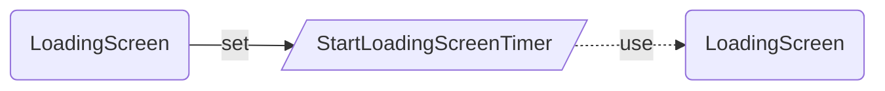
## DevHidden
  
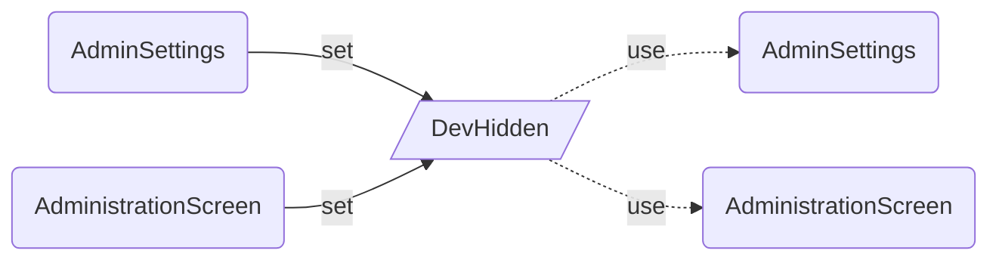
## newMyMenuID
  
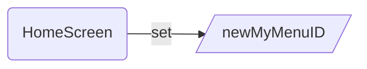
## galDefault
  

## Color3TextJSON
  
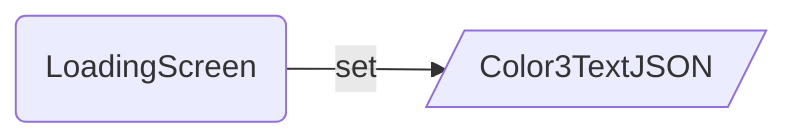
## thisMenuID
  
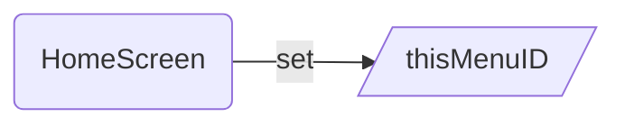
## DownloadImage
  
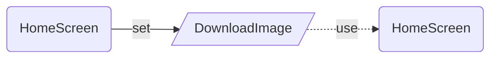
## hideMenu
  

## showCollection
  
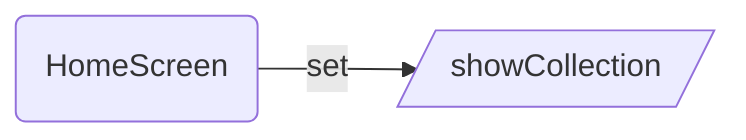
## iconicLight
  
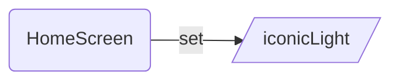
## ShowTheme
  
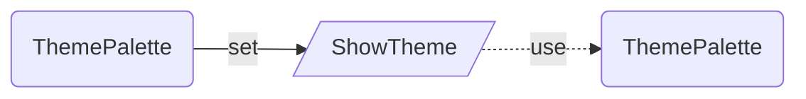
## varUser
  
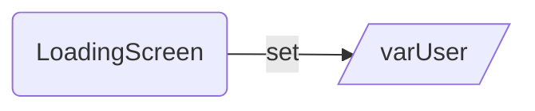
## ThisTheme
  
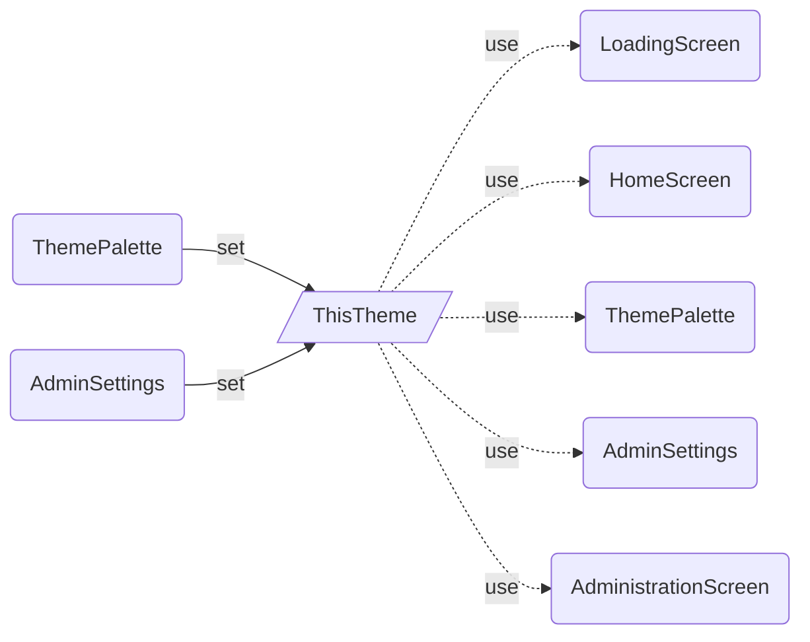
## FileValue
  
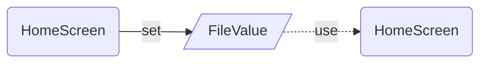
## varRecord
  
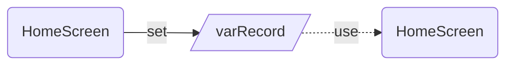
## editMenu
  
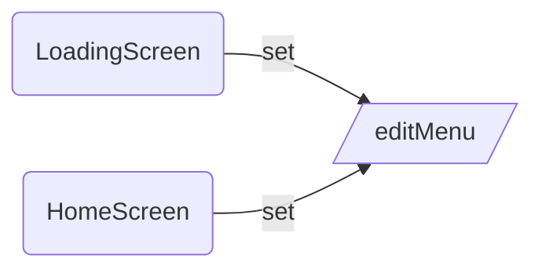
## ControlsTheme
  
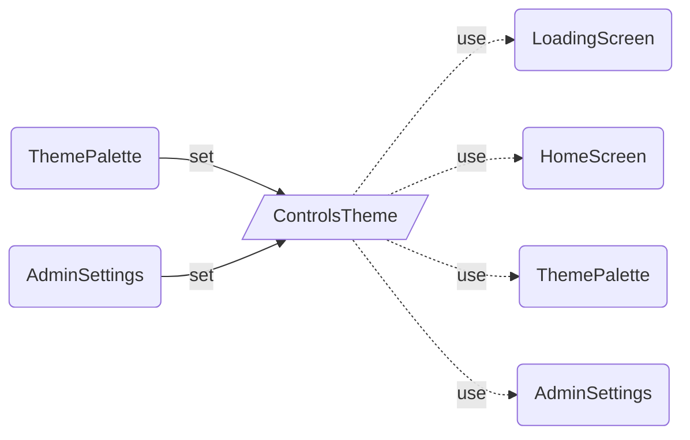
## createNewMenu
  
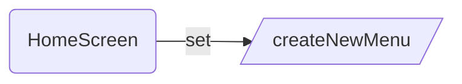
## LoadingText
  
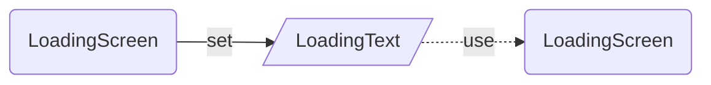
## ChosenTheme
  
```mermaid  
graph LR  
SetThemePalette(ThemePalette)-- set -->ChosenTheme[/ChosenTheme/]  
ChosenTheme[/ChosenTheme/]-. use .->UseThemePalette(ThemePalette)  
```
## onReset
  
```mermaid  
graph LR  
SetHomeScreen(HomeScreen)-- set -->onReset[/onReset/]  
```
## FontIncrement
  
```mermaid  
graph LR  
SetThemePalette(ThemePalette)-- set -->FontIncrement[/FontIncrement/]  
SetAdminSettings(AdminSettings)-- set -->FontIncrement[/FontIncrement/]  
FontIncrement[/FontIncrement/]-. use .->UseThemePalette(ThemePalette)  
FontIncrement[/FontIncrement/]-. use .->UseAdminSettings(AdminSettings)  
```
## defaultIconColor
  
```mermaid  
graph LR  
SetLoadingScreen(LoadingScreen)-- set -->defaultIconColor[/defaultIconColor/]  
```
## Color1JSON
  
```mermaid  
graph LR  
SetLoadingScreen(LoadingScreen)-- set -->Color1JSON[/Color1JSON/]  
```
## ChosenControlsTheme
  
```mermaid  
graph LR  
SetThemePalette(ThemePalette)-- set -->ChosenControlsTheme[/ChosenControlsTheme/]  
ChosenControlsTheme[/ChosenControlsTheme/]-. use .->UseThemePalette(ThemePalette)  
```
## ChosenFontSizes
  
```mermaid  
graph LR  
SetThemePalette(ThemePalette)-- set -->ChosenFontSizes[/ChosenFontSizes/]  
ChosenFontSizes[/ChosenFontSizes/]-. use .->UseThemePalette(ThemePalette)  
```
## bootstrapLight
  
```mermaid  
graph LR  
SetHomeScreen(HomeScreen)-- set -->bootstrapLight[/bootstrapLight/]  
```
## FontSizes
  
```mermaid  
graph LR  
SetThemePalette(ThemePalette)-- set -->FontSizes[/FontSizes/]  
SetAdminSettings(AdminSettings)-- set -->FontSizes[/FontSizes/]  
FontSizes[/FontSizes/]-. use .->UseHomeScreen(HomeScreen)  
FontSizes[/FontSizes/]-. use .->UseThemePalette(ThemePalette)  
FontSizes[/FontSizes/]-. use .->UseAdminSettings(AdminSettings)  
FontSizes[/FontSizes/]-. use .->UseAdministrationScreen(AdministrationScreen)  
```
## removeFav
  
```mermaid  
graph LR  
SetHomeScreen(HomeScreen)-- set -->removeFav[/removeFav/]  
```
## menuDefault
  
```mermaid  
graph LR  
SetHomeScreen(HomeScreen)-- set -->menuDefault[/menuDefault/]  
```
## AccessibilityThemeSet
  
```mermaid  
graph LR  
SetThemePalette(ThemePalette)-- set -->AccessibilityThemeSet[/AccessibilityThemeSet/]  
SetAdminSettings(AdminSettings)-- set -->AccessibilityThemeSet[/AccessibilityThemeSet/]  
```
## Developer
  
```mermaid  
graph LR  
SetAdminSettings(AdminSettings)-- set -->Developer[/Developer/]  
SetAdministrationScreen(AdministrationScreen)-- set -->Developer[/Developer/]  
Developer[/Developer/]-. use .->UseThemePalette(ThemePalette)  
Developer[/Developer/]-. use .->UseAdminSettings(AdminSettings)  
Developer[/Developer/]-. use .->UseAdministrationScreen(AdministrationScreen)  
```
## newItem
  
```mermaid  
graph LR  
SetHomeScreen(HomeScreen)-- set -->newItem[/newItem/]  
```
## editMenu
  
```mermaid  
graph LR  
SetHomeScreen(HomeScreen)-- set -->editMenu[/editMenu/]  
editMenu[/editMenu/]-. use .->UseLoadingScreen(LoadingScreen)  
editMenu[/editMenu/]-. use .->UseHomeScreen(HomeScreen)  
```
## Color3JSON
  
```mermaid  
graph LR  
SetLoadingScreen(LoadingScreen)-- set -->Color3JSON[/Color3JSON/]  
```
## ControlsTheme
  
```mermaid  
graph LR  
SetThemePalette(ThemePalette)-- set -->ControlsTheme[/ControlsTheme/]  
SetAdminSettings(AdminSettings)-- set -->ControlsTheme[/ControlsTheme/]  
```
## Color2JSON
  
```mermaid  
graph LR  
SetLoadingScreen(LoadingScreen)-- set -->Color2JSON[/Color2JSON/]  
```
## TriggerFileSelector
  
```mermaid  
graph LR  
SetLoadingScreen(LoadingScreen)-- set -->TriggerFileSelector[/TriggerFileSelector/]  
```
## galDefault
  
```mermaid  
graph LR  
SetHomeScreen(HomeScreen)-- set -->galDefault[/galDefault/]  
SetAdministrationScreen(AdministrationScreen)-- set -->galDefault[/galDefault/]  
```
## FileName
  
```mermaid  
graph LR  
SetHomeScreen(HomeScreen)-- set -->FileName[/FileName/]  
```
## Color2TextJSON
  
```mermaid  
graph LR  
SetLoadingScreen(LoadingScreen)-- set -->Color2TextJSON[/Color2TextJSON/]  
```
## Color1TextJSON
  
```mermaid  
graph LR  
SetLoadingScreen(LoadingScreen)-- set -->Color1TextJSON[/Color1TextJSON/]  
```
## galDefault
  
```mermaid  
graph LR  
SetHomeScreen(HomeScreen)-- set -->galDefault[/galDefault/]  
```
## createNewMenu
  
```mermaid  
graph LR  
SetHomeScreen(HomeScreen)-- set -->createNewMenu[/createNewMenu/]  
createNewMenu[/createNewMenu/]-. use .->UseHomeScreen(HomeScreen)  
```
## ThisCurrentControlsThemeBackup
  
```mermaid  
graph LR  
SetThemePalette(ThemePalette)-- set -->ThisCurrentControlsThemeBackup[/ThisCurrentControlsThemeBackup/]  
SetAdminSettings(AdminSettings)-- set -->ThisCurrentControlsThemeBackup[/ThisCurrentControlsThemeBackup/]  
ThisCurrentControlsThemeBackup[/ThisCurrentControlsThemeBackup/]-. use .->UseThemePalette(ThemePalette)  
ThisCurrentControlsThemeBackup[/ThisCurrentControlsThemeBackup/]-. use .->UseAdminSettings(AdminSettings)  
```
## ThisCurrentThemeBackup
  
```mermaid  
graph LR  
SetThemePalette(ThemePalette)-- set -->ThisCurrentThemeBackup[/ThisCurrentThemeBackup/]  
SetAdminSettings(AdminSettings)-- set -->ThisCurrentThemeBackup[/ThisCurrentThemeBackup/]  
ThisCurrentThemeBackup[/ThisCurrentThemeBackup/]-. use .->UseThemePalette(ThemePalette)  
ThisCurrentThemeBackup[/ThisCurrentThemeBackup/]-. use .->UseAdminSettings(AdminSettings)  
```
## editing
  
```mermaid  
graph LR  
SetHomeScreen(HomeScreen)-- set -->editing[/editing/]  
editing[/editing/]-. use .->UseHomeScreen(HomeScreen)  
```
## addedtofav
  
```mermaid  
graph LR  
SetHomeScreen(HomeScreen)-- set -->addedtofav[/addedtofav/]  
```
## ControlsFontSizes
  
```mermaid  
graph LR  
SetThemePalette(ThemePalette)-- set -->ControlsFontSizes[/ControlsFontSizes/]  
SetAdminSettings(AdminSettings)-- set -->ControlsFontSizes[/ControlsFontSizes/]  
ControlsFontSizes[/ControlsFontSizes/]-. use .->UseHomeScreen(HomeScreen)  
ControlsFontSizes[/ControlsFontSizes/]-. use .->UseThemePalette(ThemePalette)  
ControlsFontSizes[/ControlsFontSizes/]-. use .->UseAdminSettings(AdminSettings)  
ControlsFontSizes[/ControlsFontSizes/]-. use .->UseAdministrationScreen(AdministrationScreen)  
```
# DataSources
  
---
|Name|Type|SetName|
| :--- | :--- | :--- |
|MyFavouriteIcons|ConnectedDataSourceInfo|https://inspectplus.sharepoint.com/sites/IconMenuBuilder|
|MyMenuItems|ConnectedDataSourceInfo|https://inspectplus.sharepoint.com/sites/IconMenuBuilder|
|MyMenus|ConnectedDataSourceInfo|https://inspectplus.sharepoint.com/sites/IconMenuBuilder|

## Collections
  
Usage of Collections is shown based on the screen(s) where this collection is created and the screen(s) where it is 
used. 
### tempItems
  
```mermaid  
graph LR  
CreateHomeScreen(HomeScreen)-- create -->tempItems[/tempItems/]  
```
### col_icons
  
```mermaid  
graph LR  
CreateHomeScreen(HomeScreen)-- create -->col_icons[/col_icons/]  
CreateAdministrationScreen(AdministrationScreen)-- create -->col_icons[/col_icons/]  
```
### MyMenuItems
  
```mermaid  
graph LR  
CreateHomeScreen(HomeScreen)-- create -->MyMenuItems[/MyMenuItems/]  
MyMenuItems[/MyMenuItems/]-. use .->UseHomeScreen(HomeScreen)  
```
### MyMenuItems
  
```mermaid  
graph LR  
CreateHomeScreen(HomeScreen)-- create -->MyMenuItems[/MyMenuItems/]  
```
### newMenu
  
```mermaid  
graph LR  
CreateHomeScreen(HomeScreen)-- create -->newMenu[/newMenu/]  
```
### col_MyMenus
  
```mermaid  
graph LR  
CreateLoadingScreen(LoadingScreen)-- create -->col_MyMenus[/col_MyMenus/]  
CreateHomeScreen(HomeScreen)-- create -->col_MyMenus[/col_MyMenus/]  
```
### DECtoHEX
  
```mermaid  
graph LR  
CreateLoadingScreen(LoadingScreen)-- create -->DECtoHEX[/DECtoHEX/]  
```
### tempMenu
  
```mermaid  
graph LR  
CreateHomeScreen(HomeScreen)-- create -->tempMenu[/tempMenu/]  
```
### fontmenu
  
```mermaid  
graph LR  
CreateLoadingScreen(LoadingScreen)-- create -->fontmenu[/fontmenu/]  
```
### fontmenu
  
```mermaid  
graph LR  
CreateHomeScreen(HomeScreen)-- create -->fontmenu[/fontmenu/]  
CreateAdministrationScreen(AdministrationScreen)-- create -->fontmenu[/fontmenu/]  
```
### adminMenu
  
```mermaid  
graph LR  
CreateAdministrationScreen(AdministrationScreen)-- create -->adminMenu[/adminMenu/]  
```
### newMenu
  
```mermaid  
graph LR  
CreateHomeScreen(HomeScreen)-- create -->newMenu[/newMenu/]  
newMenu[/newMenu/]-. use .->UseLoadingScreen(LoadingScreen)  
newMenu[/newMenu/]-. use .->UseHomeScreen(HomeScreen)  
```
### col_MyMenuItems
  
```mermaid  
graph LR  
CreateHomeScreen(HomeScreen)-- create -->col_MyMenuItems[/col_MyMenuItems/]  
col_MyMenuItems[/col_MyMenuItems/]-. use .->UseHomeScreen(HomeScreen)  
```
### col_myFavouriteIcons
  
```mermaid  
graph LR  
CreateHomeScreen(HomeScreen)-- create -->col_myFavouriteIcons[/col_myFavouriteIcons/]  
col_myFavouriteIcons[/col_myFavouriteIcons/]-. use .->UseLoadingScreen(LoadingScreen)  
col_myFavouriteIcons[/col_myFavouriteIcons/]-. use .->UseHomeScreen(HomeScreen)  
col_myFavouriteIcons[/col_myFavouriteIcons/]-. use .->UseAdministrationScreen(AdministrationScreen)  
```
### MyMenus
  
```mermaid  
graph LR  
CreateHomeScreen(HomeScreen)-- create -->MyMenus[/MyMenus/]  
```
### flags
  
```mermaid  
graph LR  
CreateLoadingScreen(LoadingScreen)-- create -->flags[/flags/]  
```
### col_MyMenuItems
  
```mermaid  
graph LR  
CreateHomeScreen(HomeScreen)-- create -->col_MyMenuItems[/col_MyMenuItems/]  
```
### gal_mymenus.Selected.Title
  
```mermaid  
graph LR  
CreateHomeScreen(HomeScreen)-- create -->gal_mymenus.Selected.Title[/gal_mymenus.Selected.Title/]  
```
### demoMenu
  
```mermaid  
graph LR  
CreateHomeScreen(HomeScreen)-- create -->demoMenu[/demoMenu/]  
demoMenu[/demoMenu/]-. use .->UseHomeScreen(HomeScreen)  
```
### col_temp
  
```mermaid  
graph LR  
CreateHomeScreen(HomeScreen)-- create -->col_temp[/col_temp/]  
col_temp[/col_temp/]-. use .->UseHomeScreen(HomeScreen)  
```
### rowCounter
  
```mermaid  
graph LR  
CreateHomeScreen(HomeScreen)-- create -->rowCounter[/rowCounter/]  
```
### col_icons
  
```mermaid  
graph LR  
CreateHomeScreen(HomeScreen)-- create -->col_icons[/col_icons/]  
CreateAdministrationScreen(AdministrationScreen)-- create -->col_icons[/col_icons/]  
col_icons[/col_icons/]-. use .->UseHomeScreen(HomeScreen)  
col_icons[/col_icons/]-. use .->UseAdministrationScreen(AdministrationScreen)  
```
### col_fontmenu_home
  
```mermaid  
graph LR  
CreateLoadingScreen(LoadingScreen)-- create -->col_fontmenu_home[/col_fontmenu_home/]  
```
### col_myFavouriteIcons
  
```mermaid  
graph LR  
CreateLoadingScreen(LoadingScreen)-- create -->col_myFavouriteIcons[/col_myFavouriteIcons/]  
CreateHomeScreen(HomeScreen)-- create -->col_myFavouriteIcons[/col_myFavouriteIcons/]  
```