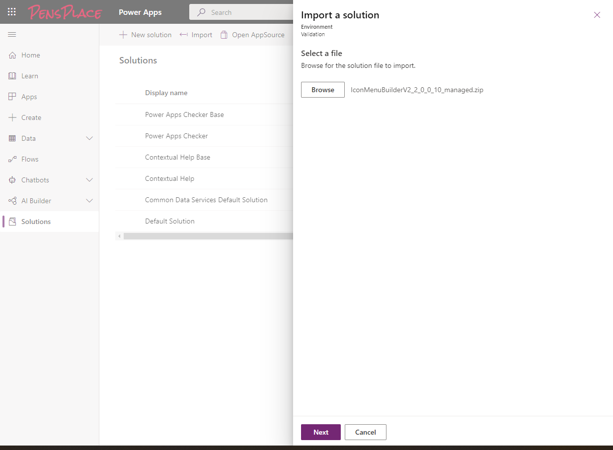
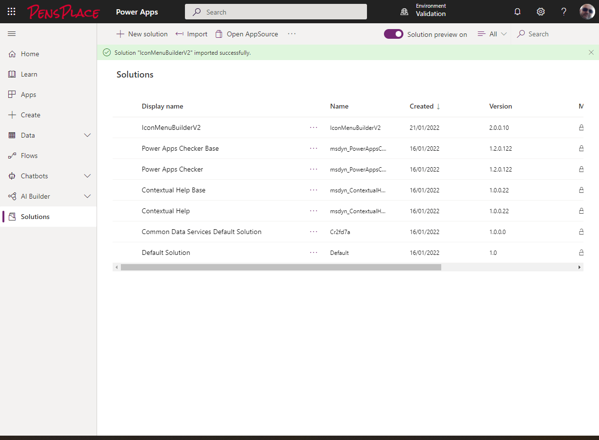

# Installation

## Pre-requisites 

### Power Apps component framework for canvas apps

To install the Icon Menu Builder you will need an Power Platform Environment configured to allow code components.


### Install the Icon Menu Builder v2 Solution 

The solution is now a single package with everything required contained.



Select or create the SharePoint connection


Select the SharePoint site URL Environment variable - Icon Menu Builder v2 SharePoint Site




## Run the SharePoint Setup Flowdd 
Open the solution and open the Icon Menu Builder - SharePoint Setup Flow


Turn on the __Flow__ and __Run__


Once the Flow completes your SharePoint site will have the 3 supporting lists.

* My Favourites
* My Menus
* My Menu Items


## Configure List Environment Variables

Configure the list environment variables by navigating to __Solutions__ and open the __Default Solution__


Select the lists that were just created for the 3 lists.


## Run the Canvas App

Navigate to __Apps__ right click on the Icon Menu Builder app and select details, copy the app url to a new browser tab and add ```&hideNavBar=true```, once opened in Edge I recommend you save it as an app and pin it to your taskbar.


Congratulations you have installed the Icon Menu Builder, I hope you find it useful.


!!! warning "Known Issue"
    If the menu doesn't appear when first loading, click on the __Home Icon__ or the __Refresh Icon__