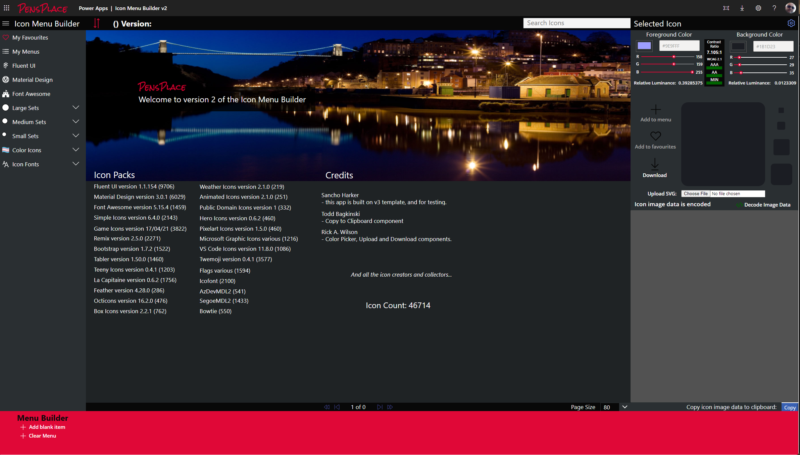

# Getting Started

:::caution Under Construction
This site is currently being updated, please check back for updates.
:::

:::warning Breaking changes
If you do have existing favourites and menus they are not compatible with version 2. I recommend Creating a new v2 site to host. I am working on a Flow to upgrade them for the final v2 release.
:::

Welcome to version 2 of the Icon Menu Builder, when you first load the app and don't have any favourites saved you will see the credits screen.

## Home Screen

Using Gestalt design principles the screen is split into 4 areas:

1. Main Menu
2. Browser 
3. Selected Icon and Settings panel and
4. Menu Builder

### Main Menu

The main menu is a 2 level menu, links with a chevron will open to show more icons...

### Main Browser

The main section of the page displays the main content for the selected menu item.

### Selected Icon and Settings Panel

Located on the right of the screen the panel shows detailed information on a selected item from the main window.

### Menu Builder

Located as the footer of the page, the menu builder displays the added icons to a new or edited menu.
