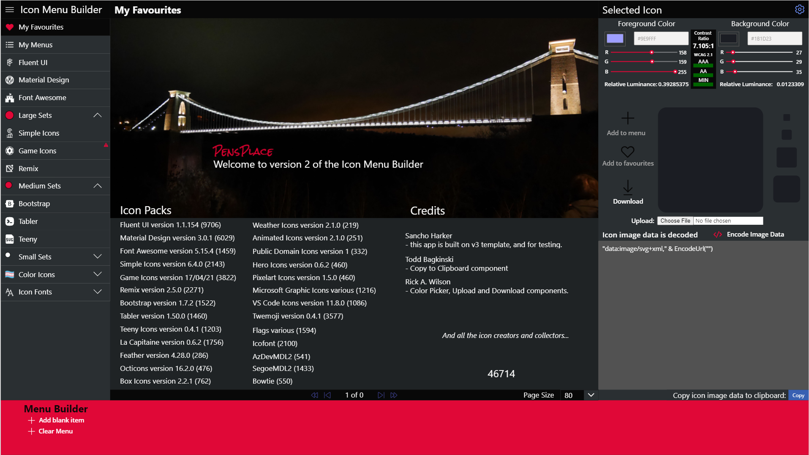

# Getting Started

:::caution Temporary Install procedure...
The Solution is currently too big to export so have created a new release with version 1.0.0.17 to be installed first and them you can import the msapp and save it, if you already have v1 installed then just open the msapp and go from there.
:::

:::warning Breaking changes
If you do have existing favourites and menus they are not compatible with version 2. I recommend Creating a new v2 site to host.
:::

Welcome to version 2 of the Icon Menu Builder, when you first load the app and don't have any favourites saved you will see the credits screen.
