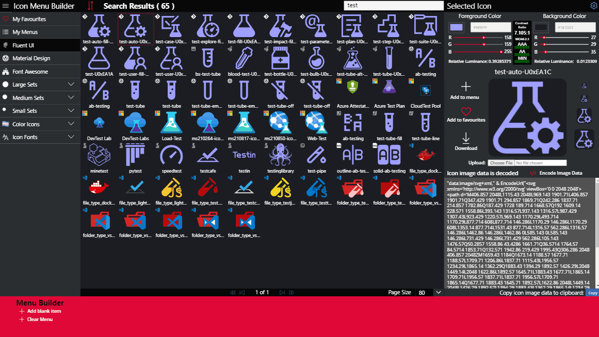
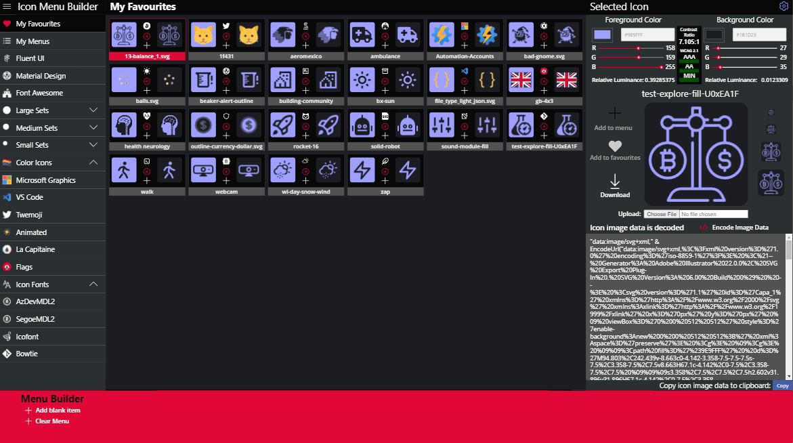
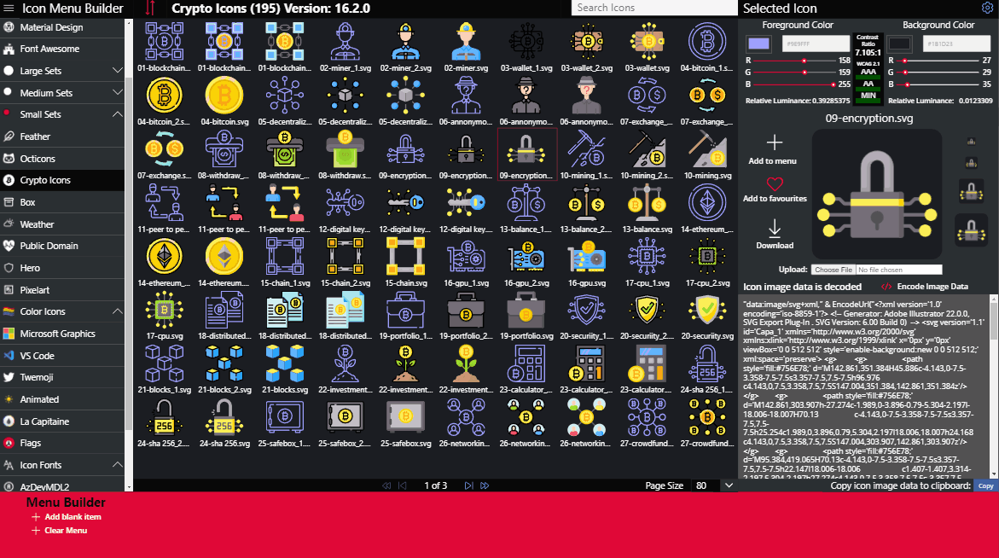
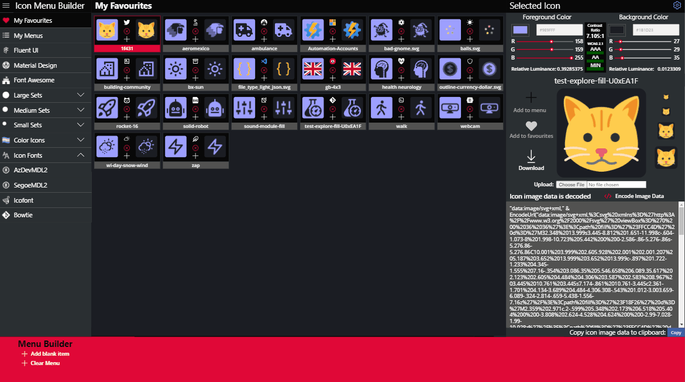

# Managing and Using Favourites

## Saving Favourites

To save a favourite select an icon in the browser window and click on the __Add to Favourite__ ❤️ Icon.

## Removing Favourites

:::caution
Deleting a favourite will immediately delete the icon from the SharePoint List __My Favourites__ there is no warning or confirmation, for me it was an unnecessary click and unneccesary controls.

You can remove a favourite in two places, first on the __My Favourites__ page:

and you can remove a favourite from the icons browser click on the __Remove from Favourites__ ❤️ Icon

:::
## Adding Favourites to a Menu

On the __My Favourites__ page,  on the Icon Card click on the + icon to add the favourite to the Menu Builder.

